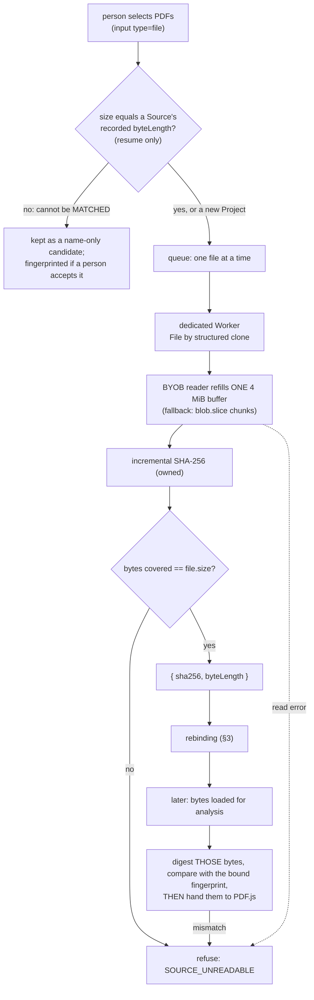

# M7 Drawing Set Manager — Architecture Research

> **RESEARCH ONLY / NOT PRODUCTION / NOT CANONICAL.**
> Evidence and a recommendation for Independent Architecture Review. Nothing in this document, in the
> proposed schema, or in the prototype is adopted. No Production file was changed.

| | |
|---|---|
| Task | M7 Drawing Set Manager — Architecture Research / Spike Task Packet v1 |
| Product Definition | M7 Product Definition v1 — HUMAN ADOPTED 2026-10-05 (`obsidian-vault@d48034ba`, `01_Projects/PDF-ArchiTools/11_M7_Product_Definition.md`) |
| App baseline | `airesearchagl-art/PDF_ArchiTools@1b5f9eda59a583a6b8fe7e07013ba38fc3053d1f` |
| Scope of change | `research/m7-drawing-set-manager/**` only |
| Revision | Focused repair after Independent Architecture Review of `4139133`: **RF-33-01** (QA02 exemption) and **RF-33-02** (QA09 is a Human-declared Drawing Register vs actual Sheets). §15 lists what changed. |
| Data Model Gate | Class B (unchanged by this research); recommendation in §12-J |

Detail lives in the companion documents; this one states what was found and what is recommended.

| Question | Section | Companion |
|---|---|---|
| R1 Source fingerprint | §2 | `benchmark/results/SUMMARY.md` §1–3 |
| R2 Source rebinding | §3 | `rebinding-state-machine.md` |
| R3 Portable Project JSON contract | §4 | `portable-project.schema.proposed.json` |
| R4 Bounded import / malformed JSON | §5 | `fixtures/`, `benchmark/results/SUMMARY.md` §7–8 |
| R5 Data model / stale dependency | §6 | `data-model.proposed.md` |
| R6 Existing-engine reuse | §7 | `reuse-audit.md` |
| R7 Title Block Profile | §8 | `title-block-profile.md` |
| R8 Drawing Set QA semantics | §9 | `qa-rule-matrix.md` |
| R9 Large Drawing Set performance | §10 | `benchmark/results/SUMMARY.md` §4–6, §9 |
| Security / privacy | §11 | `tests/privacy.test.mjs` |
| **Architecture Recommendation A–K** | **§12** | |
| Required unresolved items | §13 | |
| What was not measured | — | `limitations.md` |

**On the numbers.** Figures quoted here are rounded, from one machine (Chrome for Testing 143, headless;
Node 24; Windows 11; Core Ultra 9 285K). The exact record is `benchmark/results/SUMMARY.md`, generated
mechanically from the result files. Times and memory vary from run to run and are *measured-only*; sizes,
counts, verdicts and digests are *structural* and must be identical across runs
(`benchmark/results/structural.json`). Because a rounded figure can drift away from the run committed
beside it, **every figure quoted from a benchmark is checked against the committed result files** by
`benchmark/check-claims.mjs` — the quoted words must still be in the document and the measured value must
be within what they allow ("≈ X" allows X ± 25 %); the outcome is `benchmark/results/CLAIMS.md`. Browser
and Node evidence are never combined into one figure.

---

## 1. The recommendation in one page

1. **The Portable Project JSON is a flat, relational document**: one Drawing Set holding seven collections
   (sources, profiles, sheets, declared drawing registers, runs, findings, decisions) related by internal UUIDs. No bytes, no paths, no
   text dumps — and no property in the schema where one could be put.
2. **Nothing in the file says "stale".** Every derived record names what it was derived *from* (which
   bytes, which profile revision). Staleness is one comparison against what is there now, so a change cannot
   forget to mark something, its scope is exactly what names the changed thing, and a file cannot claim to
   be fresh.
3. **Fingerprint in a Worker, by streaming, with the repository's own SHA-256** — not Web Crypto. Measured
   in Chrome: `crypto.subtle.digest()` needs the whole file in memory (2× the file at peak), **blocked the
   calling thread for its entire duration**, does not exist when the app is served over plain HTTP, and was
   no faster end to end than the streaming JavaScript hash refilling one 4 MiB buffer.
4. **Rebinding has one rule and one hint.** SHA-256 equality is the only thing that produces `MATCHED`. A
   file name can only nominate a file as the *changed* version of a Source, which is a question for a
   person.
5. **Import is a pipeline of refusals, cheapest first** — size, encoding, a pre-parse scan, `JSON.parse`,
   version, schema, relations — with two outcomes and no third: the whole Project, or nothing. A file is
   never partly imported and never repaired. A future schema version is refused outright.
6. **The schema file is executed, not illustrated.** A small owned interpreter runs the schema and refuses a
   schema it cannot fully enforce. Export copies only what the schema declares and then runs the import
   checks on what it is about to write.
7. **QA rules are pure functions over metadata and never touch a PDF.** They are cheap enough to re-run
   after every change (roughly 25–75 ms at 5000 sheets), so only source-bound work — extraction, OCR — ever has to
   be *waited out*. A finding is identified by its question and versioned by its evidence; that is what
   carries a Human decision across re-runs and retires it when the evidence changes.
8. **Existing engines are reached through an adapter and are not modified.** The Drawing Register's
   extraction, profile geometry and duplicate rule, the Comparator's page geometry and the normaliser's
   paper-size detection are called as they are; the research harness runs the Production functions to show
   it. One additive change is needed in `src/`: an incremental form of the SHA-256 it already owns.
9. **The Data Model Gate moves to Class A at Human Architecture Adoption** — not before — and the adopted
   schema and relation contract are canonical **before** M7-P1 is implemented, not reconciled at P4.
10. **QA09 is a Drawing Register a person declared, against the Sheets that are there.** The register is
    optional and never inferred; with none, QA09 is *not evaluable* — no finding, and not a pass.

---

## 2. R1 — Source fingerprint

### What was compared

| Method | Where | How |
|---|---|---|
| `subtle-main` | page thread | `file.arrayBuffer()` → `crypto.subtle.digest()` |
| `subtle-worker` | dedicated Worker | the same |
| `stream-worker` | dedicated Worker | `blob.slice()` chunks → incremental JS SHA-256 (a new buffer per chunk) |
| `byob-worker` | dedicated Worker | BYOB reader over `file.stream()` refilling **one** 4 MiB buffer → incremental JS SHA-256 |
| `stream-main` | page thread | as `stream-worker`, for comparison only |

Synthetic files of 1, 10, 50, 100 and 250 MiB, and sets of 10 × 10 MiB and 20 × 25 MiB, selected through a
real `<input type=file>`. Every digest the page reported was checked against `node:crypto`. Memory is the
**renderer process's peak working set as the operating system reports it**, one fresh browser per run — a
direct measurement, not allocation accounting. A single file above 250 MiB was not run (not required; see
`limitations.md`).

### What was found — BROWSER (Chrome 143)

One 250 MiB file; baseline (file selected, nothing read) ≈ 66 MiB:

| | `subtle-main` | `subtle-worker` | `stream-worker` | `byob-worker` |
|---|---|---|---|---|
| Elapsed | ≈ 0.9 s | ≈ 0.9 s | ≈ 1.15 s | ≈ 1.0 s |
| Longest time the page thread was unavailable | **≈ 0.8 s** | under 30 ms | under 15 ms | under 15 ms |
| Renderer peak working set | ≈ 570 MiB | ≈ 570 MiB | ≈ 160 MiB | **≈ 87 MiB** |
| Works when served over plain HTTP | **no** | **no** | yes | yes |
| Can be stopped | no | only by terminating the Worker | between chunks (under 60 ms) | between reads |

1. **`SubtleCrypto.digest()` needs the whole input in memory.** It refuses a `ReadableStream`
   (`TypeError`); there is no way to feed it pieces. At 250 MiB the renderer peaked about 500 MiB above baseline
   — the file, twice.
2. **The digest blocked the calling thread.** `file.arrayBuffer()` and `digest()` were measured separately
   on the page thread, each under a 4 ms heartbeat: reading 250 MiB took 0.1–0.25 s and left the thread free
   (≈ 5 ms gaps); the digest took ≈ 0.75 s and **the thread was unavailable for all of it**. An
   asynchronous signature is not an asynchronous implementation. This is one browser build; why it behaves
   so was not investigated.
3. **Web Crypto was not faster where it matters.** End to end it ran at ≈ 270 MiB/s; the JavaScript hash
   refilling one buffer ran at ≈ 250 MiB/s. (In Node the same CPU's OpenSSL does ≈ 2 000 MiB/s and the
   JavaScript hash ≈ 290 MiB/s — Node evidence, quoted only to show the JS figure is
   about what the implementation can do.)
4. **In an insecure context there is no Web Crypto at all.** Served from an origin that is neither
   `localhost` nor HTTPS, `crypto.subtle` and `crypto.randomUUID` are `undefined`, in the page and in a
   Worker; `crypto.getRandomValues`, `Worker` and `Blob.stream` remain. Both one-shot methods fail; both
   streaming methods produce the correct digest. This is the situation `src/utils/split-merge/digest.ts`
   already documents: the app is also served over plain HTTP on a LAN.
5. **"One file at a time" does not bound memory if each file is a fresh buffer.** Twenty 25 MiB files,
   strictly sequential: `subtle-main` peaked at ≈ 395 MiB and `subtle-worker` at ≈ 299 MiB — the garbage
   collector had not caught up — against ≈ 158 MiB for sliced streaming and **≈ 120 MiB with one reused
   buffer**.
6. **4 MiB is the chunk size the measurement chooses.** 64 KiB ≈ 85 MiB/s, 1 MiB ≈ 186, 4 MiB ≈ 215,
   16 MiB ≈ 230; a cancellation took effect in under 20 ms, under 60 ms and under 200 ms at 1, 4 and 16 MiB
   (anywhere up to one chunk, depending on where in a chunk the request lands).
7. **A `File` reaches a Worker without its bytes being read on the page thread** (structured clone of a
   10 MiB `File`: under 2 ms).
8. **A detached buffer hashes silently to the digest of nothing.** After an ArrayBuffer is transferred
   away its `byteLength` is 0 and `digest()` returns `e3b0c442…`, the SHA-256 of zero bytes, without an
   error. PDF.js detaches the buffer it is given.
9. **A file changed on disk after selection cannot be read.** Appended, overwritten at the same size, or
   deleted: every read fails (`NotReadableError` / `NotFoundError`). The page does not silently get
   different bytes.

### Recommended fingerprint flow



- **One implementation, everywhere.** No Web Crypto path. The measured cost of giving it up in Chrome is
  under 25 % of elapsed time with one reused buffer and 10–40 % on the slice fallback; what is bought is
  flat memory, no dependence on a secure context, cancellation, and a digest that cannot depend on which
  implementation ran.
- **A dedicated Worker per job**, in the pattern Split / Merge already uses, given `File` objects, never
  bytes.
- **Strictly sequential, one reused buffer.** Expected cost ≈ 4 ms per MiB: a 250 MiB file ≈ 1 s, a
  500 MiB set ≈ 2 s, in the background.
- **Cancellation** is a message honoured between reads (≈ one chunk); terminating the Worker is the hard
  stop and costs a fresh Worker under 20 ms.
- **The size the digest covered must equal `file.size`**, which is the guard against both a short read and
  a detached buffer.
- **The fingerprint is re-checked over the bytes an analysis actually loads**, before PDF.js takes them —
  the rule Split / Merge follows (RF-R4-5).
- **Per-Source cap:** 256 MiB as a candidate, reusing M6's adopted `maxInputBytes`.

---

## 3. R2 — Source rebinding

`rebinding-state-machine.md` has the algorithm, the state diagram and the full matrix.

- **States** (`UNBOUND`, `MATCHED`, `CHANGED`, `MISSING`, `AMBIGUOUS`) are runtime only and are never
  stored. `UNBOUND` is "nobody has looked"; `MISSING` is "someone looked and it was not there".
- **The seven cases:** same name + same bytes → `MATCHED`; renamed + same bytes → `MATCHED` with a
  `RENAMED` notice (no confirmation step: the fingerprint is the adopted authority); same name + different
  bytes → `CHANGED`, never `MATCHED`; not selected → `UNBOUND` then `MISSING`; several candidates →
  `AMBIGUOUS`, no guess; two copies of the same bytes → `MATCHED` once, spare reported; one of several
  changed → a per-Source partial rebind.
- **Identical bytes are one content.** Within a Drawing Set a fingerprint identifies at most one live
  Source; the same bytes cannot be added twice. So a fingerprint match is never ambiguous.
- **`CHANGED` binds nothing.** Accepting the new bytes is a person's act that replaces the fingerprint
  (the old one goes to history); from that moment everything read from the old bytes is stale by
  comparison, and nothing is erased.
- **A changed Source does not stale the Project.** Its own sheets' data goes stale; findings that cite
  those sheets go stale; set-wide candidates are unverified until the set is whole again; every other
  Source, sheet, finding and decision is untouched (`STALE_MATRIX`, held row by row by
  `tests/stale.test.mjs`).

---

## 4. R3 — Portable Project JSON contract

`portable-project.schema.proposed.json` is the proposal. It is draft-07-compatible JSON Schema, restricted
to a subset the owned interpreter executes.

### Shape

```jsonc
{
  "format": "pdf-architools/drawing-set-project",   // which kind of file this is
  "schemaVersion": 1,                               // an integer; any change of shape is a new one
  "projectFileId": "…",                             // names THIS saved file; new on every save
  "lineage": { "saveSequence": 3, "previousProjectFileId": "…", "migratedFrom": null },
  "savedAt": "2026-10-05T09:00:00.000Z",
  "writer": { "app": "PDF_ArchiTools", "toolVersion": "…" },
  "project": { "id": "…", "name": "…", "createdAt": "…" },
  "drawingSet": {
    "id": "…", "name": "…", "createdAt": "…",
    "sources": [],             // Source Manifest: fingerprint + fingerprintHistory
    "titleBlockProfiles": [],
    "sheets": [],              // pageFacts · profileAssignment · observation · confirmation · history
    "drawingRegisterReferences": [],  // OPTIONAL: a list a person declared, as field-level rows
    "analysisRuns": [],
    "findings": [],
    "decisions": []
  }
}
```

### Decisions the proposal makes

| Topic | Proposal | Why |
|---|---|---|
| `schemaVersion` | one integer; no minor version | A reader either knows a shape exactly or does not. "Compatible additions" need a rule for unknown fields, and the only safe rule is refusal. |
| `projectFileId` | identifies one **saved file**; every save mints a new one and records the one it came from | Two files of one Project can be ordered without trusting a clock, and a migrated file can name its origin. `project.id` is the Project. |
| Stable ids | lower-case UUID on every entity, one namespace for the whole file | From `crypto.getRandomValues`: `randomUUID` is unavailable in an insecure context (measured). |
| Referential integrity | every reference resolves or the file is refused whole | An import that drops a dangling decision has changed a review record without anyone deciding to. |
| Required / optional | everything required; `null` means "not yet" | No "absent means default" for a reader to get wrong. |
| Append-only | `fingerprintHistory`, `confirmationHistory`, decisions (numbered 1…n per finding), findings (only their lifecycle changes) | Product Definition principle 8: resolving is never deleting. |
| Retire, never delete | `retiredAt` on Source, Sheet, Profile | References stay valid; history stays readable. |
| Stale / superseded | `STALE` is derived and never stored; `SUPERSEDED` / `NOT_REPRODUCED` are recorded facts about later runs | §6. |
| **Unknown field** | **refuse** | Ignoring it means dropping it at the next save: a silent, lossy rewrite — the "best-effort mutation" the Product Definition rules out. |
| **Unknown enum value** | **refuse** | The same. |
| **Future `schemaVersion`** | **refuse**, before any schema is consulted | Product Definition: "reject unsupported future schema versions rather than best-effort mutation". Not opened read-only either: a file this build cannot save safely is not open. |
| **Old `schemaVersion`** | never read directly; migrated (below) | |
| Text | every string bounded and in one storable domain: no control characters, no direction overrides, no lone surrogates | Machine-read text is brought into that domain where it enters the model, so a title block with a control character cannot make a Project unsaveable. |
| Timestamps | UTC, millisecond, `toISOString()` form; calendar validity checked | A wrong clock is surfaced as a warning (QA10), not a refusal. |
| Numbers | finite; integers safe; every one ranged | `JSON.parse("1e400")` is `Infinity`, silently. |
| Serialisation | canonical: the schema's property order, compact | The same model always gives the same bytes. An indented copy is accepted on import but is ≈ 1.55× larger (≈ 13.5 vs 8.8 MiB at 5000 sheets). |
| Not in the file | binding state, stale flags, file handles, paths, bytes, images, page text, the author of a decision | Runtime state, derived state, or forbidden content. |

### Migration

| Strategy | Verdict |
|---|---|
| Refuse old files | The app is a web page that is always the latest build: an old file would simply become unreadable. Not acceptable once anyone has a file. |
| Migrate silently on open | A person's file changes meaning without being told, and "what did it convert?" has no answer. |
| **Validate as old → migrate in memory → show what changed → leave only as a new file** | **Recommended.** |
| Write old versions too | A second writer to keep correct for no reader. No. |

```text
old JSON
 → bounded parse (the same bounds as any file)
 → validate against THAT version's own frozen schema
 → pure function: version n → n+1  (repeat)
 → validate again as a current file      (conversion earns no trust)
 → MIGRATED_IN_MEMORY + a report a person is shown
 → the file on disk is untouched; the Project can only leave as a new file,
   whose lineage names the file it came from
```

`prototype/migrate.mjs` implements this, and `tests/migration.test.mjs` exercises it with a **synthetic**
predecessor (there is no real version 0; the fixture exists only to drive the mechanism). The consequence
for Production is that **every released schema version's schema file is kept**, not only the newest:
"validate, then migrate" is only as good as the validation. How many versions back to support is a policy
decision — Unresolved U-10.

---

## 5. R4 — Bounded import and malformed JSON

A Portable Project JSON is a file from outside.

### The pipeline

| Stage | Question | Refusals (examples) | Cost paid before it |
|---|---|---|---|
| `bytes` | how big is it | `PROJECT_TOO_LARGE`, `EMPTY_INPUT` | **none** — `file.size` |
| `encoding` | is it UTF-8 | `NOT_UTF8` | a decode |
| `scan` | how deep, how many, any duplicate key | `NESTING_TOO_DEEP`, `TOO_MANY_VALUES`, `TOO_MANY_KEYS`, `STRING_TOO_LONG`, `KEY_TOO_LONG`, `DUPLICATE_KEY`, `NOT_AN_OBJECT`, `UNTERMINATED` | one pass that builds nothing |
| `parse` | is it JSON | `INVALID_JSON` | `JSON.parse` |
| `version` | is it ours, and which version | `NOT_A_PROJECT_FILE`, `VERSION_UNREADABLE`, `UNSUPPORTED_FUTURE_VERSION`, `OLD_VERSION_REQUIRES_MIGRATION` | — |
| `schema` | does every value have a shape | `SCHEMA_UNKNOWN_FIELD`, `SCHEMA_REQUIRED`, `SCHEMA_TYPE`, `SCHEMA_ENUM`, `SCHEMA_PATTERN`, `SCHEMA_STRING_LENGTH`, `SCHEMA_ARRAY_LENGTH`, `SCHEMA_NUMBER_NOT_FINITE`, … | a walk no deeper than the schema |
| `relations` | does it mean something | `REL_DUPLICATE_ID`, `REL_DANGLING_SOURCE` / `_SHEET` / `_FINDING`, `REL_DECISION_EVIDENCE`, `REL_FINDING_LIFECYCLE`, `REL_TIMESTAMP_INVALID`, … | one pass over each collection |

Why a scan before `JSON.parse`, when `JSON.parse` is the right parser:

- **Duplicate keys.** `JSON.parse` keeps the last and says nothing: `{"schemaVersion":1,…,"schemaVersion":2}`
  is version 2 to this app and version 1 to a tool that keeps the first. Only something that looks at the
  text can refuse it.
- **Cost.** A byte bound alone does not bound memory. `JSON.parse` on 28.6 MiB of `{},{},…` retained
  ≈ 640 MiB of heap in Node and ≈ 320 MiB in Chrome and took ≈ 1.5 s; the scan refuses it in ≈ 0.1 s having
  allocated nothing.
- **Depth.** `JSON.parse` *accepts* a million levels of nesting (≈ 0.1 s); the next thing to walk the result
  recursively overflows the stack. The scan refuses it in a millisecond or so. (The owned schema
  walk is immune anyway — the schema has no recursion, so it never descends further than the schema is
  deep — but that is a second line, not the first.)

### The adversarial inputs

Small ones are committed under `fixtures/` with the verdict each must get (`fixtures/expected.json`); large
ones are generated inside the tests and benchmarks and never written to disk.

| Input (Task Packet list) | Outcome |
|---|---|
| invalid JSON | `scan` / `parse` |
| unsupported `schemaVersion` (future) | `version / UNSUPPORTED_FUTURE_VERSION`; a string, fraction, negative, `1e400` → `VERSION_UNREADABLE` |
| missing required field | `schema / SCHEMA_REQUIRED`, with the path |
| duplicate project / source / sheet / finding / decision id | `relations / REL_DUPLICATE_ID` — also across kinds |
| dangling `sourceId` / `sheetId` / `findingId` | `relations / REL_DANGLING_*` |
| huge string | `scan / STRING_TOO_LONG` (10 MiB, not parsed); one character over a field bound → `schema` |
| huge arrays | `scan / TOO_MANY_VALUES`; a collection over its bound → `schema`, **without being walked** |
| excessive nesting | `scan / NESTING_TOO_DEEP` at 17, 1 000 and 200 000 levels |
| unexpected object keys | `schema / SCHEMA_UNKNOWN_FIELD`, including `__proto__`, `constructor`, `prototype`; a duplicate key → `scan` |
| URL-like strings | in a file name → refused; in free text → **accepted as text** (below) |
| HTML / script-like strings | accepted as text in free-text fields, byte for byte |
| Windows / UNC-like path strings | in a file name → refused (`C:\…`, `\\server\…`, `/…`, `..`); in free text → accepted as text |
| Base64-like huge payload | bounded like any string; as an undeclared field → `SCHEMA_UNKNOWN_FIELD` |
| malformed SHA-256 | `schema` — upper case, wrong length, non-hex, wrong algorithm |
| pathological numbers | `Infinity` (`1e400`), fractions, unsafe integers, underflow to 0, negatives, wrong type → `schema` |
| timestamp anomalies | malformed → `schema`; no such instant (`2026-13-45`) → `relations`; ten years ahead → **accepted with a warning** |

**Free text is data, not a threat to refuse.** A person may write `<script>` or a path in a comment or a
drawing title; refusing that would refuse real titles (`1/100 平面図`). The contract is on the other side:
**such text is only ever rendered as text** — never as markup, never as a link, never opened. The schema
helps by having no property typed as a URL or a path, so nothing downstream is ever *handed* one.

### Candidate limits

None of these is a Production constant. "Measured need" is from the scale benchmark; where a limit has no
measurement behind it, it says so.

| Limit | Candidate | Measured need | Basis |
|---|---|---|---|
| `maxProjectBytes` | 64 MiB | ≈ 8.8–10.4 MiB at 5000 sheets | ≈ 6× the largest measured. A valid 62.5 MiB file opened in ≈ 0.2 s (Node). |
| `maxNestingDepth` | 16 | 7 | ≈ 2× |
| `maxJsonValues` | 4 000 000 | ≈ 338 000–397 000 at 5000 sheets | ≈ 10×, and above the ≈ 2.4 M the entity limits admit together |
| `maxObjectKeys` | 32 | 15 (widest object in the schema) | ≈ 2×; **added because a measurement found the hole** — see `limitations.md` |
| `maxKeySourceLength` | 64 | 25 | ≈ 2.5× |
| `maxStringSourceLength` | 24 000 | 4 000 × 6 | the longest field, written entirely as `\uXXXX` |
| `maxSheets` | 5 000 | — | the upper bound this research was asked to consider |
| `maxSources` | 5 000 | — | one PDF per sheet is a real way drawing sets arrive |
| `maxFindings` | 50 000 | ≈ 2 500–5 600 at 5000 sheets | ≈ 9×, for a Project's lifetime: findings are never deleted |
| `maxDecisions` | 100 000 | ≈ 1 300 | two per finding at the finding limit |
| `maxSourceBytes` | 256 MiB | — | M6's adopted `maxInputBytes` |
| `maxPagesPerSource` | 5 000 | — | one Source may hold the whole set |
| `maxPagePoints` | 14 400 | — | 200 inches: the largest page PDF allows without `/UserUnit` |
| `maxFileNameLength` | 255 | — | the file-name limit of the common file systems |
| `maxProfiles` 64 · `maxAnalysisRuns` 2 000 · history per Source 64 · per Sheet 32 · `maxRegisterReferences` 64 · `maxRegisterEntriesPerReference` 1 000 | | **not measured** | placeholders; Unresolved U-6 |
| name 200 · field value 300 · field raw text 1 000 · comment 4 000 | | **not measured** | placeholders; need real title blocks or a product decision — U-6 |

**What the bounds cost and what they leave.** A 5000-sheet Project opens in ≈ 90–125 ms on a page thread
(Chrome); the scan is the largest single stage of that. The costliest input the scan lets through is ≈ 4 million empty
objects (11.4 MiB): refused at `schema` after ≈ 0.55 s and ≈ 256 MiB of heap in Node (≈ 104 MiB in
Chrome). That is the residual worst case of *these* candidates, and it is the price of leaving room for a
Project's findings to accumulate; a tighter `maxJsonValues` buys it down proportionally.

**Where import runs.** On the page thread it is one task of about a tenth of a second at 5000 sheets. That is acceptable for
an action a person takes once per session, and moving it to a Worker costs a structured clone of the
result. Recommended: page thread for the first implementation; revisit if the limits are raised.

---

## 6. R5 — Data model and stale dependency

`data-model.proposed.md` has the conceptual and logical models, the contract table and the state machines.

- **Relations, corrected from the Product Definition's sketch:** the collections are flat under the Drawing
  Set and related by id (a nested tree would make every reference implicit); Title Block Profile is an
  entity of the Drawing Set; a Finding relates to Sheets and Sources N:M, not as a child of one.
- **Analysis Run ↔ Source fingerprint:** each run carries a `manifestDigest` (the SHA-256 of every live
  Source's `(id, sha256)`), and each observation and finding carries the exact fingerprints of what it
  cites. A list of fingerprints per run was tried first and dropped: with one PDF per sheet it adds
  ≈ 650 KB per run at 5000 sheets (5000 × ≈ 130 bytes; computed, not measured).
- **A Finding may depend on one Sheet, several, the whole set, or an entry of a declared register**, and
  that is recorded as its `scope` and decides when a run may close it (`qa-rule-matrix.md` §5).
- **An optional declared Drawing Register is two more entity types** (`DrawingRegisterReference`,
  `RegisterEntry`): a list a person designated on one page of one Source, bound to those bytes, holding
  field-level rows only. It is never inferred, and its basis is fixed — declared again, it is a new
  reference and the old one is retired (`data-model.proposed.md` §2A).
- **A Review Decision depends on the Finding version — by construction.** A Finding is immutable; a changed
  statement is a new Finding; a Decision names one Finding and repeats its evidence digest, and import
  refuses a mismatch.
- **Human comments survive a Source change as history:** the decision stays attached to the finding it was
  made about; the finding is superseded or left stale; nothing is rewritten.
- **Human-confirmed metadata becomes a re-confirmation candidate:** kept, shown, not trusted, and moved to
  `confirmationHistory` when a person confirms again.
- **Stale / current / superseded** are two axes — a stored lifecycle (`ACTIVE` / `SUPERSEDED` /
  `NOT_REPRODUCED`) and a derived currency (`CURRENT` / `UNVERIFIED` / `STALE` / `HISTORICAL`).
- **A finding in a file is recognised, never believed.** QA is re-evaluated on open and the file's findings
  are matched against the result; a forged finding is closed by that first run.

---

## 7. R6 — Existing-engine reuse

`reuse-audit.md` has the per-candidate table.

| Reuse as is, through an adapter | Do not reuse | Additive change needed |
|---|---|---|
| `extractRegister` + `RegisterOcrEngine` (and through them native tokens, OCR, classification) · `transferRect` / `applyProfile` · `displayValue` · `findDuplicates` · `pageGeometry` · `detectPaperSize` · `configurePdfWorker` · `RunOwnership` · the one-Worker-per-job pattern · **`analysePageGeometry` + `reconstructSelection` (the M2-4 table engine), for a declared Drawing Register** | the annotator's viewer components · the Comparator's source handling · whole-document text extraction · the title-block **updater** (a writer, in another coordinate space) · `processor/source-facts` page sizes (MediaBox) | an incremental SHA-256 beside `contentDigest` · (optional) an exported orientation helper · an engine version constant |

No existing file has to change for M7 to begin. The claim is run, not asserted:
`tests/reuse-parity.test.mjs` imports the Production modules unchanged and requires (i) a profile saved by
M7 and reloaded to place every rectangle *identically* under the engine's `applyProfile`; (ii) QA01 to
report exactly the groups `findDuplicates` reports; (iii) M7's page facts to equal `pageGeometry`'s; (iv) the
size class to equal `detectPaperSize` on 2 350 sizes. Check (iv) **failed on its first run** — the
prototype's copy of the 5 mm rule disagreed at exactly 5 mm — which is the argument for importing the
function instead of restating it.

The same is done for the declared Drawing Register (RF-33-02): `tests/declared-register.test.mjs` runs
Production's `reconstructSelection` on a synthetic list page — ruled, unruled, and scanned — and declares a
register from the grid it returns through `prototype/register-list-adapter.mjs`, then evaluates QA09. The
table engine is unchanged. It reads native text only, so a scanned list is refused by the engine and is
declared by typing it; and its reading of the *whole page's* text never leaves the adapter.

---

## 8. R7 — Title Block Profile

`title-block-profile.md` has the comparison.

- **Store the register's own representation**: rectangles in upright page space, in PDF points, with the
  reference page's size and a transfer model a person chose. Normalised fractions are what the
  `normalised` model *computes*; storing only them would turn every `corner-anchored` profile into a
  `normalised` one.
- **Rotation, CropBox / MediaBox, portrait / landscape are not properties of a profile.** Rectangles are
  upright; the box is the visible box PDF.js reports; orientation follows from the page.
- **Assignment is per sheet and by a person.** Source-level and page-range assignment are operations in the
  workspace that write one assignment per sheet.
- **Several profiles per Drawing Set**, each with its own `revision`. A change to one profile stales the
  observations and profile-based confirmations of *its* sheets and nothing else — a refinement of the
  engine's single arrangement counter, not a contradiction of it.
- **Fields:** `drawingNumber`, `drawingTitle`, `revision`, `issueDate`, mapped onto the engine's four.

---

## 9. R8 — Drawing Set QA semantics

`qa-rule-matrix.md` has the matrix.

| Deterministic — a fact | Candidate — a question |
|---|---|
| 1 duplicate number (exact, as the register engine defines it) · 2 metadata unconfirmed · 4 same number / different title · 5 revision mismatch *within one number* · 6 issue-date mismatch *within one number* · 9 **declared Drawing Register vs actual Sheets** (`LISTED_BUT_MISSING`, `ACTUAL_NOT_LISTED`) · 10 Source / Project integrity, including M7's Sheet list vs each Source's pages | 1b the same number written differently · 3 number gap · 7 sheet-size outlier · 8 orientation outlier |

- No rule says a drawing is wrong, and none closes itself.
- Determinism is about the rule, not its inputs: a fact about a value only the OCR has read is a fact about
  an unconfirmed value. Final requires confirmed metadata, so at Final every input is confirmed.
- **QA09 compares a Drawing Register a person declared with the Sheets that are actually there.** The
  register is optional and never inferred. With none declared QA09 is `NOT_EVALUABLE` — no finding, and
  not a pass: the Final-readiness result says the comparison was not made. A declared register that is no
  longer current (its Source's bytes were replaced) is not compared with anything either, and blocks Final
  until it is declared again. M7's own Sheet list against each Source's page inventory is kept, under
  QA10 (`PAGE_WITHOUT_SHEET`, `SHEET_WITHOUT_PAGE`). *(RF-33-02.)*
- **Only `INTENTIONAL` on a QA02 finding lifts the metadata-confirmation requirement from a sheet.**
  `FALSE_POSITIVE` does not: QA02 states a fact, and a QA02 believed wrong is answered by confirming the
  sheet, after which the next run does not reproduce it. `ACTION_REQUIRED` and `HOLD` do not either, and a
  Source that is not `MATCHED` blocks Final independently of every decision. *(RF-33-01.)*
- Two item names admit a wider reading than the one proposed (5, 6): "differs from what this issue is
  supposed to be" needs an expectation **declared by a person**. A declared register row can carry a
  revision and a date, so it is now a possible source of one; that comparison is not designed here (U-2).

---

## 10. R9 — Large Drawing Set performance

Portable state and the QA engine only; nothing was rendered. Page thread, Chrome 143 (Node agrees to within
run-to-run variation):

| | 200 sheets | 1 000 sheets | 5 000 sheets | 5 000, one PDF per sheet | 20 000 (beyond the limit) |
|---|---|---|---|---|---|
| File, compact | ≈ 0.35 MiB | ≈ 1.77 MiB | ≈ 8.8 MiB | ≈ 10.4 MiB | ≈ 35 MiB |
| Save (project, validate, serialise) | ≈ 3 ms | ≈ 15 ms | ≈ 95 ms | ≈ 115 ms | ≈ 400 ms |
| Open (decode, scan, parse, schema, relations) | ≈ 4 ms | ≈ 18 ms | ≈ 92 ms | ≈ 120 ms | ≈ 420 ms |
| QA, all rules | ≈ 1 ms | ≈ 5 ms | ≈ 27 ms | ≈ 31 ms | ≈ 120 ms |
| — duplicate-number detection alone | under 1 ms | under 1 ms | under 1 ms | under 1 ms | ≈ 1 ms |
| — gap detection alone | under 1 ms | under 1 ms | ≈ 1 ms | ≈ 1.5 ms | ≈ 4 ms |
| Sort by drawing number (collated, shuffled input) | under 1 ms | ≈ 1 ms | 3–9 ms | 4–10 ms | 25–50 ms |
| Filter | under 1 ms | under 1 ms | under 1 ms | under 1 ms | under 2 ms |
| Currency of every sheet and finding | under 1 ms | under 1 ms | under 2 ms | under 2 ms | under 6 ms |
| One Source replaced: what goes stale | 25 of 200 sheets | 25 of 1 000 | 25 of 5 000 | 1 of 5 000 | 25 of 20 000 |

- **Everything is linear** in the number of sheets, at ≈ 1.8–2.2 kB and ≈ 67–79 JSON values per sheet.
- **5 000 sheets is comfortable**: about a tenth of a second to open or save, tens of milliseconds for a
  full QA evaluation. With nothing confirmed (5 607 findings) QA is ≈ 62 ms.
- **Re-evaluating after every edit is affordable**, which is what the stale design relies on.
- **A declared register is cheap.** One of 4 898 rows (five references) adds ≈ 0.95 MiB to a 5000-sheet
  file — about 200 bytes per row — and QA with it took under 60 ms.
- **The portable state is not what makes a large set slow.** Fingerprinting costs ≈ 4 ms per MiB (§2) and
  extraction costs a page read — and, for scanned sheets, a recognition — per sheet. Neither was
  re-measured here; they belong to the existing engines.
- **List virtualisation is needed.** As a lower bound (plain DOM, no framework, eight cells per row): 1 000
  rows take ≈ 30 ms for a layout pass and ≈ 30 ms for a restyle; 5 000 rows ≈ 150 ms each; 20 000 ≈ 650 ms.
  A React list pays that plus reconciliation. The existing viewer mounts every page with no virtualisation,
  which M7 must not copy. Recommended: virtualise the Sheet List from the start.
- **Cancellation:** a fingerprint stops within one chunk (under 60 ms at 4 MiB); an extraction stops between pages (the engine's
  existing `shouldCancel`), but a recognition already running cannot be interrupted (≤ one page).

---

## 11. Security and privacy review

### Does anything forbidden reach the file?

| Must never be in a Project JSON | How the architecture excludes it | Check |
|---|---|---|
| source PDF bytes / Base64 | no property for it; every string bounded (largest: a 4 000-character comment); the writer copies only declared properties | `privacy.test.mjs` — schema scan; a `Uint8Array` on the model does not reach the file |
| rendered page image, thumbnail | the same | `data:` URL on a sheet does not reach the file |
| full page text | the same; the engine's per-page tokens never leave `extractRegister` | `pageText`, `tokens` on a sheet do not reach the file |
| raw OCR full text | the same; words outside every field rectangle are discarded by the engine | `ocrWords` does not reach the file |
| absolute path | `displayName` cannot hold a separator or a drive colon — by schema pattern on import, by sanitising on intake | Windows, UNC, POSIX, `..`, `file:`, `https:` all refused |
| UNC path | the same | |
| `FileSystemHandle` | no property; binding is runtime-only state kept outside the model | `handle` does not reach the file |
| Blob URL | the same | `blob:` does not reach the file |
| token / credential | no property | `authToken`, `cookies` on the model do not reach the file |
| debug object dump | no property; unknown keys are not carried | `debug.objectGraph`, a PDF.js proxy do not reach the file |
| a drawing list's page text, table grid or cell image | a declared register holds **field-level rows only** (number, title, revision, date) plus where the table was; the adapter drops the page's tokens and the engine's grid | `declared-register.test.mjs` — `pageText`, `tokens`, `grid`, `candidate`, `cellImage` on a register do not reach the file; `fixtures/invalid/register-with-page-text.json` is refused |

The allow-list is the mechanism: **export walks the schema, not the object.** Whatever a session hangs on
the in-memory model, the file holds only what the schema declares, in the schema's order, and is then
validated as if it had come from outside.

One boundary case needs a Human decision. The proposal stores, per title-block field, the **text read
inside that one rectangle** (`rawText`, bounded at 1 000 characters) — the register's "what does the sheet
actually say", kept so a reviewer can see it after resume without re-running OCR. It is an excerpt of a
title-block cell, not page text and not an OCR page result, but it is machine-extracted text. See
Unresolved U-5.

### The file is confidential

**A Project JSON holds project metadata that is confidential in its own right**: the project's name, source
file names (which often name the client or the job), drawing numbers and titles, revisions and dates, the
declared drawing list — which is the project's whole issue schedule in one place — what QA found, and a
reviewer's own comments. The absence of the PDF does **not** make it non-sensitive, and the
workspace must not describe it that way (Product Definition, "Portable Project Security Boundary").
`tests/privacy.test.mjs` ends by asserting what the file *does* contain, so this is not lost among the
things that are absent.

### The file is untrusted

| Product Definition requirement | In the proposal |
|---|---|
| strict schema / semantic validation | schema with no open object, then relations |
| bounded arrays / strings / object counts | every array `maxItems`, every string `maxLength`, every object closed — enforced by the interpreter refusing a schema that is not |
| no executable content | nothing in the file is evaluated; no `eval`, no `new Function` (the reason for an owned interpreter over a compiling validator) |
| no HTML / script trust | free text is accepted as text and must only be rendered as text |
| no automatic local path open | no property can hold a path |
| no external URL action | no property is a URL; nothing is fetched |
| reject future schema versions | refused at the `version` stage |

Three things the proposal does **not** provide, stated so they are not assumed:

- **The file is not tamper-evident.** There is no signature and no keyed digest. Anyone can edit it and
  produce a well-formed file. What limits the damage is that the file is never *believed* about the
  drawings: fingerprints are re-checked against real bytes, and findings are re-derived on open. A forged
  **Human decision**, however, is indistinguishable from a real one. Unresolved U-14.
- **Decisions carry no author.** There are no accounts (adopted contract D). Unresolved U-9.
- **A future export of findings to a spreadsheet** would need its own defence: a comment beginning `=` is
  inert in JSON and is a formula in a cell. Out of scope here; recorded for whoever designs the report.

---

## 12. Architecture Recommendation

One recommended architecture. Each item is a decision *proposed* for Human Architecture Adoption.

### A. Portable Project JSON structure
A single JSON document: an envelope (`format`, integer `schemaVersion`, per-save `projectFileId`,
`lineage`, `savedAt`, `writer`), a `project`, and one `drawingSet` with seven flat collections related by
UUID — sources, profiles, sheets, **declared drawing registers (optional, each with its rows)**, runs,
findings, decisions. Everything required, `null` for "not yet". Retire, never delete. Canonical compact serialisation.
The in-memory model has the same shape as the file, with all runtime state kept outside it.

### B. Fingerprint implementation
The repository's own SHA-256 in an incremental form, fed in a dedicated Worker by a BYOB reader refilling
one 4 MiB buffer (falling back to `blob.slice()` chunks), strictly one file at a time; no Web Crypto path.
The digest must cover exactly `file.size`. The fingerprint is recomputed over the bytes an analysis loads,
before PDF.js takes them. Per-Source cap 256 MiB (candidate).

### C. Source rebinding algorithm
Pass 1: fingerprint equality → `MATCHED` (the only way). Explicit Human assignments → `CHANGED`. Pass 2:
a file-name nomination, only if unique both ways → `CHANGED`; otherwise `AMBIGUOUS` or `MISSING`. A pure
function of manifest and candidates. Identical bytes cannot be two Sources. Accepting changed bytes is a
Human act that replaces the fingerprint and erases nothing.

### D. Dependency / stale model
Every derived record carries its basis (source fingerprint; profile id and revision; evidence digest).
`STALE` and `UNVERIFIED` are computed, never stored. Two tiers: source-bound data (page facts,
observations) that needs the PDF to refresh, and metadata-bound data (findings) that is re-evaluated after
every change. A run never closes a finding it could not evaluate.

### E. Schema validation strategy
The schema file is the single statement of structure, executed by an owned interpreter of a JSON Schema
subset that **refuses** unsupported keywords and any schema that is not closed and bounded. A separate
relations pass checks identity, references and lifecycle. Import: bytes → encoding → scan → parse → version
→ schema → relations, all-or-nothing. Export: project through the schema (allow-list), then run the import
checks on the result. An independent implementation (ajv) agrees with the interpreter on every fixture.

| Alternative | Why not |
|---|---|
| Hand-written validator, schema file as documentation | Two statements of the structure that drift apart. |
| ajv | A new runtime dependency that compiles validators with `new Function`; unknown keywords are ignored by default. Useful as a differential check in tests, which is how it is used here. |
| A TypeScript-first schema library | A new dependency; the schema would live in code, not in a file a reviewer or another tool can read. |

### F. Proposed resource limits
The candidates of §5, each with its basis, and none a Production constant. Two honest gaps: the string
lengths and four of the count limits have no measurement behind them (U-6), and what a person sees when a
Project reaches a limit is not designed (U-6).

### G. Title-block profile model
The Drawing Register's own representation — upright points, reference page size, a Human-chosen transfer
model, four required fields — plus a per-profile `revision`. Assignment per sheet, by a person, with the
moment recorded. Several profiles per Drawing Set.

### H. Existing-engine reuse boundary
M7 calls existing engines through a pure adapter and mounts none of the existing components. Reused as
they are: register extraction (and through it tokens, OCR, classification), profile transfer geometry,
`displayValue`, `findDuplicates`, `pageGeometry`, `detectPaperSize`, `configurePdfWorker`, `RunOwnership`,
and the M2-4 table engine (`analysePageGeometry`, `reconstructSelection`) for a declared Drawing Register.
Not reused: the annotator's viewer, the Comparator's source handling, whole-document text extraction, the
title-block updater. One additive change in `src/`: an incremental SHA-256.

### I. QA engine boundary
Pure functions over the model — no PDF, no DOM, no React — returning drafts; a separate reconcile step
writes them. Findings keyed by question and versioned by evidence. Rules are DETERMINISTIC (a fact) or
CANDIDATE (a question); none judges a design. QA is re-evaluated on every change and on open; a
re-evaluation that changes nothing writes nothing. QA09 is evaluated only against a Drawing Register a
person declared and that is current; otherwise it is reported as not evaluable, never as passed. The
metadata-confirmation requirement is lifted from a sheet only by `INTENTIONAL` on its QA02 finding.

### J. Data Model Gate recommendation
**Class B now; Class A at Human Architecture Adoption.** Every Class-A criterion of the Gate holds for the
proposed model — ten entity types after RF-33-02 (eight, plus Drawing Register Reference and Register
Entry) — and adoption of a Portable Project schema is the Gate's own B → A trigger. This research does not
change the class, and until adoption nothing here is canonical and the diagrams are proposed projections.

The timing, stated exactly (`data-model.proposed.md` §8):

| When | What is true |
|---|---|
| At Human Architecture Adoption | The Data Model moves B → A. The adopted **machine-readable schema and its semantic relation contract become the canonical source** — not a diagram. |
| Before M7-P1 implementation | That canonical contract already exists. P1 is implemented against it (`data_model_impact: NEW`). |
| During P1–P3 | No Portable Project file has shipped, so the schema is pre-release and may change **without an end-user migration** — but **any semantic change of shape updates the canonical contract first and passes review**. Implementation does not drift from the adopted model to be reconciled at P4. |
| At M7-P4 | `schemaVersion: 1` is fixed with the first release that writes a file. After that, a change of shape is a new version with a migration. |

### K. Implementation split

Proposed, not started. Each phase is one PR from fresh `main`, with its own Core CI gate in the
repository's existing style (`scripts/smoke-*.mjs`).

| Phase | Delivers | New in `src/` | Not yet |
|---|---|---|---|
| **M7-P1 — Workspace and Source foundation** | the sixth workspace; select PDFs; fingerprint in a Worker; Source Manifest and Sheet inventory in memory; page facts; a virtualised Sheet List; a read-only viewer pane | incremental SHA-256 (additive, beside `contentDigest`); fingerprint Worker; M7 domain core (ids, model operations) as pure TypeScript with Node tests; PDF.js document discipline (one open, destroyed on change) | profiles, QA, saving |
| **M7-P2 — Title Block Profiles and register metadata** | several profiles; per-sheet assignment (with bulk operations); extraction through the register adapter; Human confirmation with history; per-profile staleness | register adapter; currency (stale) module; an engine version constant | QA, saving |
| **M7-P3 — QA and Human review** | the rule engine and reconciliation; **declaring a Drawing Register from a table a person points at (or by typing it), and QA09 against it**; append-only decisions; currency of findings; the Final-readiness gate (including "not evaluable"); inspector and history; bulk review | QA rules; reconcile; readiness; the register-list adapter over the M2-4 table engine | saving |
| **M7-P4 — Portable Project save / resume** | the adopted schema as a file; owned interpreter; relations; bounded import; allow-list export; rebinding and its Human flows (`CHANGED`, `AMBIGUOUS`); QA re-evaluation on open; migration framework (no migration yet); Final QA Report | schema, interpreter, import / export, rebind | — |

- **The canonical contract comes before the code, and the save button comes last.** The adopted schema
  and relation contract exist before P1 starts (J). The model the workspace keeps in memory *is* that
  contract's shape from P1 on, and each phase implements more of it under test. `schemaVersion: 1` is not
  written to a person's disk until P4, so until then a change of shape needs **no end-user migration** —
  but it is never informal: **it is a reviewed change to the canonical contract, made before the
  implementation that depends on it.** P1–P3 do not drift from the adopted model and catch up at P4. What
  P4 fixes is the *version*, of a format three phases have already been held to.
- **The alternative** — ship save / resume second — finds persistence problems earlier, at the price of
  versioning a format that is still growing. This research has already exercised the complete format, which
  is the main argument for the order above.
- **Each phase leaves the five existing tools untouched** except for the shell edit in P1 (a mode, a
  button, a render line, a version entry, a guide section).

---

## 13. Required unresolved items

For Independent Architecture Review and the Human Gate. None is decided by this research.

| # | Question | What the proposal assumes meanwhile |
|---|---|---|
| **U-1** | Does `HOLD` count as reviewed for a *Final* QA Report? | By the letter of the adopted contract, yes; the stricter reading is one option (`holdBlocksFinal`). |
| **U-2** | What do "revision mismatch" and "issue-date mismatch" mean in one Drawing Set? | Differences *within one drawing number*. A comparison with an expected revision or issue date needs that expectation declared by a person; a declared register row may now carry one, and comparing a Sheet with its row beyond the number is not designed. |
| **U-3** | *Resolved by review (RF-33-02):* QA09 is a Human-declared Drawing Register vs actual Sheets. **What remains open about it:** (a) should a number that matches only once folded (full-width vs half-width) correspond, rather than be a hint? (b) a register that is not on a page of a Source in the set (an externally supplied list); (c) a scanned list page — the table engine reads native text only; (d) whether a register row's machine reading should be kept beside the declared value. | (a) No: exact number only, the folded spelling is a hint. (b) Not modelled. (c) Declared by typing (`MANUAL`). (d) No: the register is Human-declared; only `origin` records that a row was read, corrected or typed. |
| **U-4** | When a person accepts changed bytes, is "page *n* is the same sheet as before" an acceptable default? | Yes, as a candidate that must be re-read and re-confirmed. Inserted pages break it; matching sheets across revisions is M8. |
| **U-5** | May a bounded excerpt of title-block field text (`rawText`) be persisted? | Yes, ≤ 1 000 characters per field. The alternative is to store only the proposed value and re-read on demand. |
| **U-6** | (a) The string lengths and six count limits (including the two for a declared register) have no measurement behind them. (b) What happens when a Project reaches a limit — what may be compacted, and what does the person see? | (a) Placeholders. (b) Save is refused; no compaction beyond unreferenced runs. |
| **U-7** | Must a Source pass M6's Load Boundary before PDF.js opens it in M7? | Not decided. The boundary protects pdf-lib's loader; M7 reads with PDF.js. Split / Merge does run it before its PDF.js preview. |
| **U-8** | Is the engine's `revision_date` (shown as 日付) M7's `issueDate`? | Mapped one to the other; the name is the Task Packet's. |
| **U-9** | Should a decision record who made it? | No — there are no accounts in M7. |
| **U-10** | How many old schema versions must stay readable? | All of them, until decided otherwise. |
| **U-11** | *Resolved by review (RF-33-01):* only `INTENTIONAL` on a QA02 finding lifts the metadata-confirmation requirement; `FALSE_POSITIVE`, `ACTION_REQUIRED` and `HOLD` do not. | Implemented and tested (`tests/final-readiness.test.mjs`). |
| **U-12** | Must every Source be `MATCHED` for a report to be Final? | Yes. |
| **U-13** | Are the candidate sub-tier QA01B, the gap run bound (5) and the outlier majority (> 50 %) wanted, and at those values? | Present, at those values, each removable without touching anything else. |
| **U-14** | Is a Project file that is not tamper-evident acceptable? | Yes for M7; the file is never believed about the drawings, but a forged decision cannot be told from a real one. |
| **U-15** | Is evidence from one browser on one machine enough to adopt B? | Stated plainly in `limitations.md`; the fallbacks are designed in, the other browsers are not measured. |

---

## 14. Evidence index

| Evidence | Where |
|---|---|
| Research tests (schema, import, relations, rebinding, stale, QA, migration, privacy, parity, fixtures) | `tests/*.test.mjs`; output in `evidence/tests.txt` |
| Each test suite shown a broken prototype | `tests/mutation-probe.mjs`; `evidence/mutation-probe.json` |
| Proposed JSON round trip | `tests/roundtrip.test.mjs` |
| Invalid JSON rejection | `tests/bounded-import.test.mjs`, `fixtures/invalid/`, `fixtures/expected.json` |
| Referential-integrity rejection | `tests/relations.test.mjs` |
| Source rebinding cases | `tests/rebind.test.mjs` |
| Stale propagation cases | `tests/stale.test.mjs` |
| Final readiness and the QA02 exemption (RF-33-01) | `tests/final-readiness.test.mjs` |
| Declared Drawing Register and QA09, with the Production table engine run unchanged (RF-33-02) | `tests/declared-register.test.mjs`; `prototype/register-list-adapter.mjs` |
| Performance matrix | `benchmark/results/SUMMARY.md` (from `*.json`); `benchmark/results/structural.json` |
| Every quoted figure held to the committed results | `benchmark/check-claims.mjs`; `benchmark/results/CLAIMS.md` |
| Existing-engine reuse audit | `reuse-audit.md`; `tests/reuse-parity.test.mjs` |
| Production source delta = 0; existing checks unaffected | `evidence/gates.md` |
| What was not measured, and every instrument defect found | `limitations.md` |

---

## 15. Independent Architecture Review of `4139133`: repairs and advisories

### Repairs

| Finding | What was wrong | What changed | Where |
|---|---|---|---|
| **RF-33-01** | `FALSE_POSITIVE` on a QA02 finding exempted the sheet from the metadata-confirmation requirement. QA02 states a fact; calling it false does not make the metadata confirmed. | Only `INTENTIONAL` lifts the requirement. `FALSE_POSITIVE`, `ACTION_REQUIRED` and `HOLD` do not. A QA02 believed wrong is answered by confirming the sheet, and the next run does not reproduce it. | `prototype/currency.mjs` (`EXEMPTS_FROM_METADATA_CONFIRMATION`); `qa-rule-matrix.md` QA02, §4; `tests/final-readiness.test.mjs`; two mutation probes |
| **RF-33-02** | QA09 was redefined as M7's internal Sheet list vs the PDF page inventory. The intended meaning is a Human-declared Drawing Register (図面一覧) vs actual Sheets. | QA09 = `LISTED_BUT_MISSING` / `ACTUAL_NOT_LISTED` against an **optional, declared** register; not evaluable (no finding, not a pass) when none is declared. The page-inventory check is kept as QA10 (`PAGE_WITHOUT_SHEET`, `SHEET_WITHOUT_PAGE`). Two entity types added: `DrawingRegisterReference`, `RegisterEntry`. The M2-4 table engine is reached through an adapter, unchanged. | schema; `prototype/qa-rules.mjs`, `currency.mjs`, `model-ops.mjs`, `semantic.mjs`, `register-list-adapter.mjs`; `data-model.proposed.md` §2A; `qa-rule-matrix.md` QA09 / QA10; `reuse-audit.md` candidate 13; `tests/declared-register.test.mjs`; mutation probes |
| Clarification | §12-J and §12-K could be read as letting P1–P3 drift from the adopted model until P4. | The canonical contract exists before P1; P1–P3 may revise it without an end-user migration, but only through a reviewed change to the contract. | §12-J, §12-K; `data-model.proposed.md` §8 |

### Advisories recorded

These are not changes to the recommendation. They are conditions on what follows it.

1. **The bounded JSON scanner and the owned schema interpreter are security-sensitive code.** In this
   research they have been shown a hand-written list of hostile inputs, a set of mutation probes, and a
   differential comparison with ajv over 26 mutations of one document. **Before M7-P4 ships**, the Production
   versions must additionally have **fuzz testing, property-based testing and differential testing** — a
   search, not a list — over the whole import pipeline. `limitations.md` already records that no fuzzing was
   done here; this makes closing that gap a release condition of P4.
2. **Evidence from Chrome 143 is sufficient for this Research Gate, and not for release.** Production
   **M7-P1** (fingerprinting in a Worker, the BYOB reader and its fallback) and **M7-P4** (file open and
   save) must each define the browsers they target and a smoke test that runs on them. The design's
   fallbacks exist for exactly the cases this research did not measure.
3. **A Vercel Preview built automatically when a pull request is pushed is not a Production deployment.**
   It is the platform's behaviour for a pushed branch with a pull request, and it happened for this
   research branch (a deployment by `vercel[bot]`, environment `Preview`). It is recorded as platform
   behaviour (`limitations.md` §4). Nothing is deployed by hand from a research branch; a local build of
   this branch is byte-identical to a local build of the base commit (`evidence/gates.md`).
