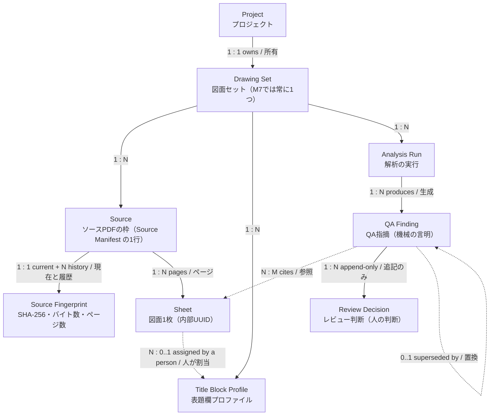
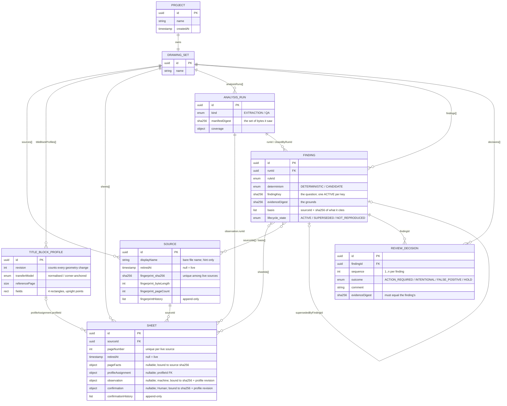
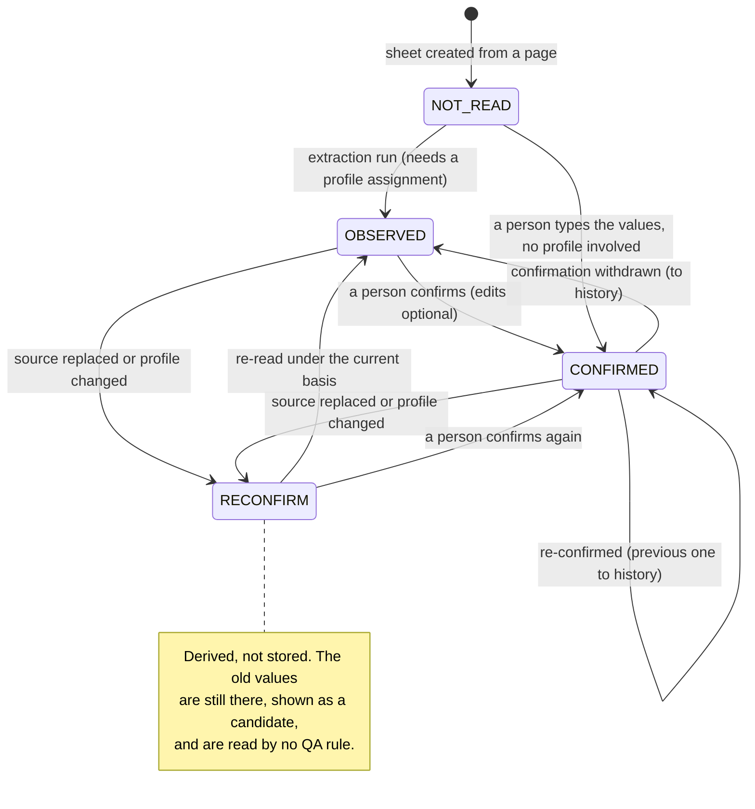
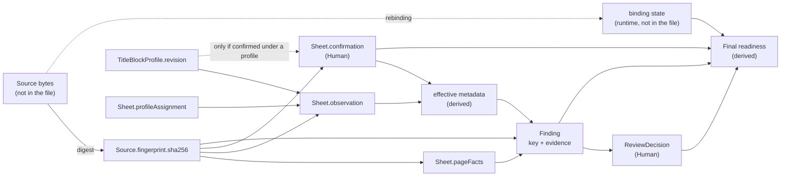

# Proposed data model and stale dependency (R5)

> **RESEARCH ONLY / NOT PRODUCTION / NOT CANONICAL.**
> A *proposed* conceptual model and a *proposed* logical model, for Independent Architecture Review.
> This is not a canonical ERD and adopts no schema. The machine-readable statement of the same model is
> `portable-project.schema.proposed.json` (structure) plus `prototype/semantic.mjs` (relations).
> The Data Model Gate stays **Class B** until a Human adopts otherwise — see §8.

## 1. Proposed conceptual model

Ownership, as the Product Definition lists the candidate entities, with the one change research suggests:
Title Block Profile is an entity of the Drawing Set in its own right, because Sheets refer to it.

Solid arrows are ownership; dashed arrows are references by id.

## 2. Proposed logical model

Persisted as **flat collections under the Drawing Set, related by id** — not as the nested tree above. A
nested file would bury a Sheet under its Source and a Decision under its Finding, which makes every reference
implicit and every integrity check a tree walk. Flat collections make each relation an explicit, checkable
foreign key, keep the document seven containers deep (measured; `maxNestingDepth` candidate 16), and are
what the import validator can bound.

Attributes are abbreviated; the schema file is the full statement.

## 3. Data Model Contract minimum (Data Model Gate §3)

| Item | Proposed |
|---|---|
| **Entities** | Project, Drawing Set, Source (+ Source Fingerprint), Title Block Profile, Sheet, Analysis Run, QA Finding, Review Decision |
| **Primary key** | An internal lower-case UUID on every entity. One namespace across all entity types: no id is used twice anywhere in a file (`REL_DUPLICATE_ID`). Minted from `crypto.getRandomValues`, because `crypto.randomUUID` does not exist in an insecure context (measured: `browser-probes.json`). |
| **Identity that is *not* the key** | `drawingNumber` is a property of a Sheet (adopted contract J). `displayName` is a label. `sha256` is content identity — what binds bytes to a Source, not what a Source *is*: a Source keeps its id when a person accepts new bytes for it. |
| **Foreign keys** | `Sheet.sourceId`; `Sheet.profileAssignment.profileId`; `Sheet.observation.runId`; `*.profile.profileId`; `Finding.runId`, `.lifecycle.closedByRunId`, `.lifecycle.supersededByFindingId`, `.sheetIds[]`, `.sourceIds[]`, `.basis[].sourceId`; `ReviewDecision.findingId`. Every one must resolve, or the file is refused whole. |
| **Cardinality** | Project 1:1 Drawing Set (M7). Drawing Set 1:N of each collection. Source 1:N Sheet. Profile 1:N Sheet (0..1 per Sheet). Finding N:M Sheet and N:M Source. Finding 1:N Decision. Finding 0..1 → Finding (supersession). |
| **Required / optional** | Every property the schema lists as `required` is present, with `null` for "not yet" (`pageFacts`, `profileAssignment`, `observation`, `confirmation`, `retiredAt`, `completedAt`, lifecycle fields). There is no "absent means default". |
| **Uniqueness** | id (global); `sha256` among live Sources; `(sourceId, pageNumber)` among live Sheets; one `ACTIVE` Finding per `findingKey`; `sequence` 1..n per Finding. |
| **Ownership** | The Drawing Set owns every collection. A Sheet belongs to exactly one Source for life. A Decision belongs to exactly one Finding for life. |
| **Delete behaviour** | **Nothing is deleted.** A Source or Sheet a person removes is *retired* (`retiredAt`), stays in the file, and keeps every reference to it valid. A replaced fingerprint or confirmation moves to its history list. A Finding is never removed to resolve it (adopted contract K): it becomes `SUPERSEDED` or `NOT_REPRODUCED`. The one exception is an Analysis Run that nothing refers to any more, which carries no information and is pruned at save. |
| **Lifecycle** | §4–§6 below. |
| **Permission boundary** | None in M7: no accounts, no server (adopted contract D). A Decision therefore records no author — Unresolved U-9. |

## 4. Bases: how a derived record is bound to what it came from

Every derived record states its **basis** — the exact inputs it was derived from. Nothing is marked stale;
a record *is* stale when its basis no longer equals what is there now. This is the whole stale mechanism.

| Record | Basis it carries | Stale when |
|---|---|---|
| `Sheet.pageFacts` | `sourceSha256` | ≠ the Source's current fingerprint |
| `Sheet.observation` | `sourceSha256`, `profile { profileId, profileRevision }`, `runId` | fingerprint differs → `STALE_SOURCE`; the sheet is no longer assigned that profile, or the profile's revision moved → `STALE_PROFILE` |
| `Sheet.confirmation` | `sourceSha256`, `profile` (or `null` if confirmed with no profile involved) | same two tests; a confirmation made without a profile is untouched by profile changes |
| `Finding` | `basis[] { sourceId, sha256 }` for every Source it cites; and `evidenceDigest` over (rule version, cited sheets with their fingerprints, the values that make it true) | any cited fingerprint differs, or a cited Source or Sheet was retired |
| `AnalysisRun` | `manifestDigest` = SHA-256 of the sorted `(sourceId, sha256)` pairs of every live Source | informational: says which exact set of bytes a run saw |
| `ReviewDecision` | `evidenceDigest`, which must equal its Finding's | never stale itself; it is *about* one immutable statement |

Why a digest on the run instead of a list: with one PDF per sheet, listing every Source's fingerprint on
every run adds about 650 KB to a 5000-sheet file per run. The digest binds a run to the same set of bytes in
64 characters, and the exact per-Source binding lives on each record that cites a Source.

### Analysis Run ↔ Source fingerprint

- An **extraction** run stamps each observation with the `sourceSha256` it actually read.
- A **QA** run stamps each finding with the fingerprints of the Sources it cites, and itself with the
  `manifestDigest`.
- At analysis time the bytes are re-digested and compared with the bound fingerprint before anything is
  read from them (recommendation B) — the rule Split / Merge already follows (RF-R4-5).

## 5. Sheet metadata: machine-observed vs Human-confirmed

- **The two are stored side by side and never merged.** `observation` is what the machine read;
  `confirmation` is what a person stands behind. A correction does not overwrite the machine's reading
  (`tests/qa-rules.test.mjs`, "a confirmed value overrides the observed one…").
- **A score never confirms anything** — the existing register's rule, kept. `ocrScore` is stored as a sort
  key and is read by nothing that decides.
- **What a QA rule reads** ("effective" values): the confirmation if it stands; else the observation if it
  stands; else nothing — and a sheet with nothing is reported by QA02 rather than guessed at.
- **Human-confirmed metadata as a re-confirmation candidate.** When the Source is replaced the confirmation
  is not erased and not trusted: its basis no longer matches, so it is shown as "previously confirmed" and
  the sheet goes back to needing a person. Re-confirming moves the old one to `confirmationHistory`
  (`RECONFIRMED`). That is how a Human comment or value survives a Source change as history.

## 6. Finding and Decision: stale, current, superseded

Two axes, deliberately separate.

**Stored — `lifecycle.state`** (what later runs have said about this statement):

| State | Meaning |
|---|---|
| `ACTIVE` | The latest statement of this question. |
| `SUPERSEDED` | A later run stated the same question (`findingKey`) on different evidence; `supersededByFindingId` points at it. |
| `NOT_REPRODUCED` | A later run that *could* evaluate the question no longer found it. |

**Derived — currency** (can this statement be believed right now):

| Currency | Meaning |
|---|---|
| `CURRENT` | `ACTIVE`, its basis equals the manifest, its Sources are `MATCHED` this session, and (for a set-wide rule) the whole set could be evaluated. |
| `UNVERIFIED` | `ACTIVE` and consistent with the manifest, but a cited Source is not bound, or the set is not fully evaluable. |
| `STALE` | `ACTIVE`, but stated about bytes the Source no longer has (or about a retired sheet). |
| `HISTORICAL` | Not `ACTIVE`. |

```mermaid
stateDiagram-v2
    [*] --> ACTIVE: a QA run states it
    ACTIVE --> ACTIVE: later run, same key, same evidence (nothing written)
    ACTIVE --> SUPERSEDED: later run, same key, different evidence
    ACTIVE --> NOT_REPRODUCED: later run could evaluate it and did not find it
    ACTIVE --> ACTIVE: later run could NOT evaluate it (left as is; derived STALE)
    SUPERSEDED --> [*]
    NOT_REPRODUCED --> [*]
```

**Does a Review Decision depend on the Finding version? Yes — by construction.** A Finding is immutable
apart from its lifecycle; a changed statement is a *new* Finding. A Decision names a `findingId` and repeats
that Finding's `evidenceDigest`, and import refuses a Decision whose digest is not its Finding's
(`REL_DECISION_EVIDENCE`). So:

- same question, same evidence on the next run → the same Finding, and the Decision stands;
- same question, different evidence (a third sheet joins a duplicate; the Source was replaced) → a new
  Finding with no Decision, and the old Decision stays attached to the old Finding as history
  (`tests/qa-rules.test.mjs`, "changed evidence supersedes…"; `tests/stale.test.mjs`, "re-reading and
  re-confirming…");
- a person changes their mind → a new Decision with the next `sequence`; the earlier one stays.

A Decision is never edited, moved, or deleted by anything in the prototype. The effective Decision of a
Finding is the one with the highest `sequence`.

**A finding in a file is recognised, never believed.** QA is re-evaluated when a Project is opened (it costs
milliseconds), and the findings in the file are matched against the fresh result by key and evidence. A
well-formed finding that the metadata does not support is closed by that first run
(`tests/qa-rules.test.mjs`, "a forged one is closed by the first run"). What the file contributes is
identity and Human history, not truth.

## 7. Dependency graph

Expensive edges (they need the PDF) are the ones out of **Source bytes**. Everything to the right of
*effective metadata* is recomputed from data already in the model. That split is why a Source change can
leave data stale for a while and a metadata edit cannot.

## 8. Data Model Gate re-evaluation

**Current:** Class B — ERD Candidate (Product Definition v1, principle 11).

**Recommended: promote to Class A — ERD Recommended — *at Human Architecture Adoption*, not before.**

Against the Gate's own A-criteria (`Data_Model_Gate.md` §4B, "A判定の目安"), every one holds for the model
this research proposes:

| Gate criterion | In the proposed model |
|---|---|
| Several persistent entities / artifacts | Eight entity types in one durable artifact |
| 1:1 / 1:N / N:M relations | All three (§3) |
| References by id / FK / content hash / immutable reference | UUID foreign keys throughout; SHA-256 content identity; immutable Findings |
| History / revision / run / evidence / state transition | `fingerprintHistory`, `confirmationHistory`, append-only Decisions, Analysis Runs, Finding lifecycle |
| Ownership / lifecycle / append-only / create-once is central to the contract | Retire-never-delete, append-only Decisions, one-ACTIVE-per-key |
| A coding agent misreading the structure causes serious drift | The stale mechanism, decision carry-over and rebinding all rest on which record carries which basis |

And the Gate's B → A trigger ("validation-only concept が実際の durable artifact model になった") is exactly
what Human Adoption of a Portable Project schema would be. The Gate also says a database is not required:
"JSON … でも、relation が canonical contract なら A になり得る".

Why it is **not** Class A today: nothing here is canonical. The schema is a proposal, no relation contract
is adopted, and the Gate says not to draw a future entity's ERD ahead of its adoption. The diagrams above are
*proposed projections*, labelled as such, and are research evidence only.

If adopted, the Gate's canonical-source rule (§2) points at a **machine-readable model, not at a diagram**:
the schema file (structure) with the relation rules alongside it would be the canonical source, and the
Mermaid diagrams would be projections of it. `data_model_impact` for the first Production M7 PR would be
`NEW`.
