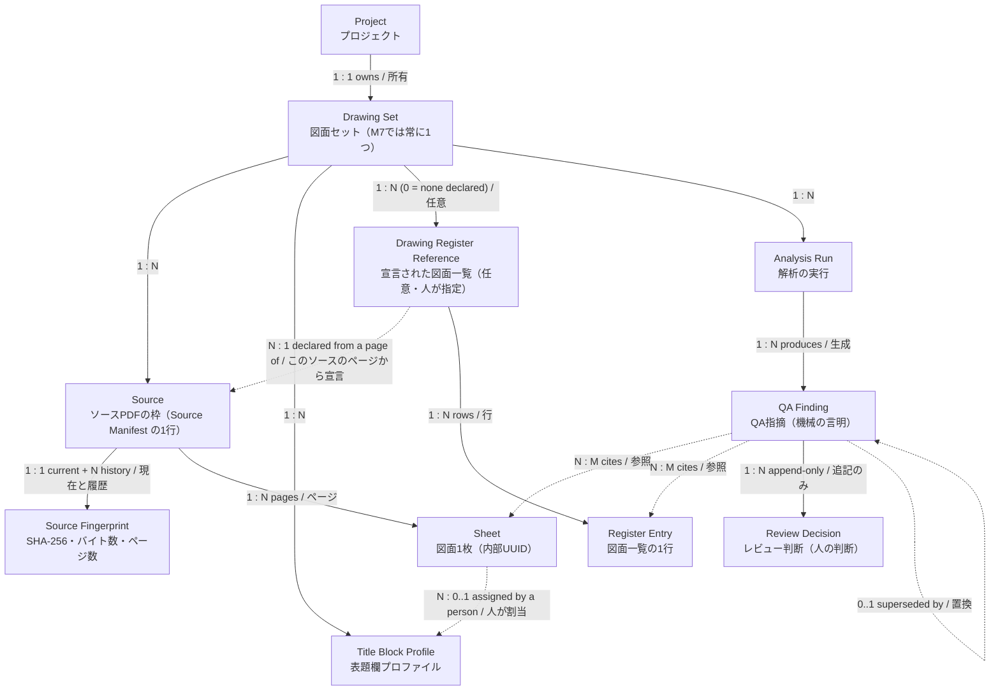
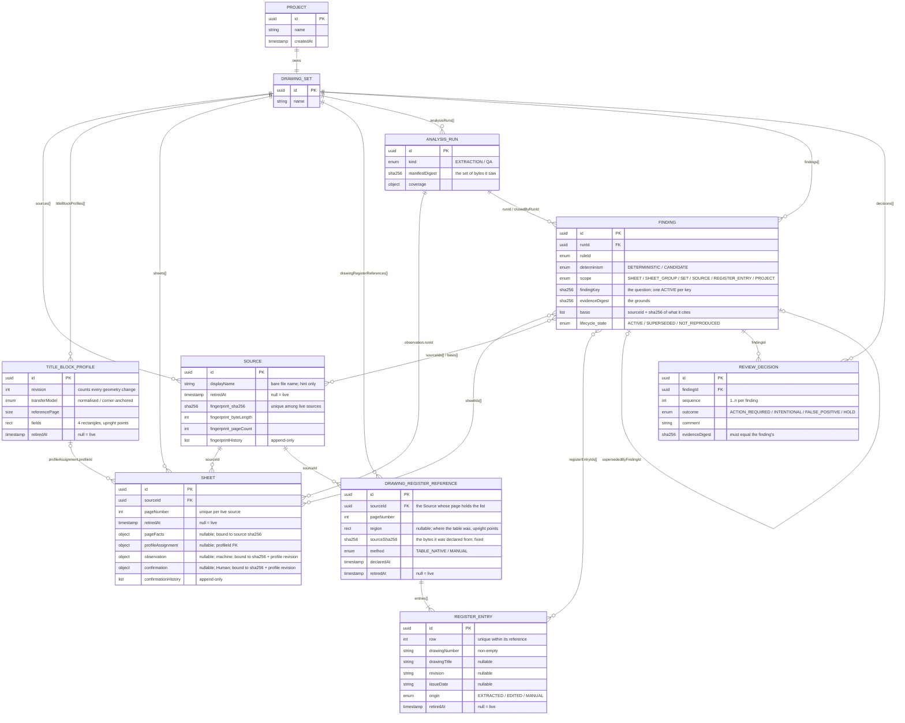
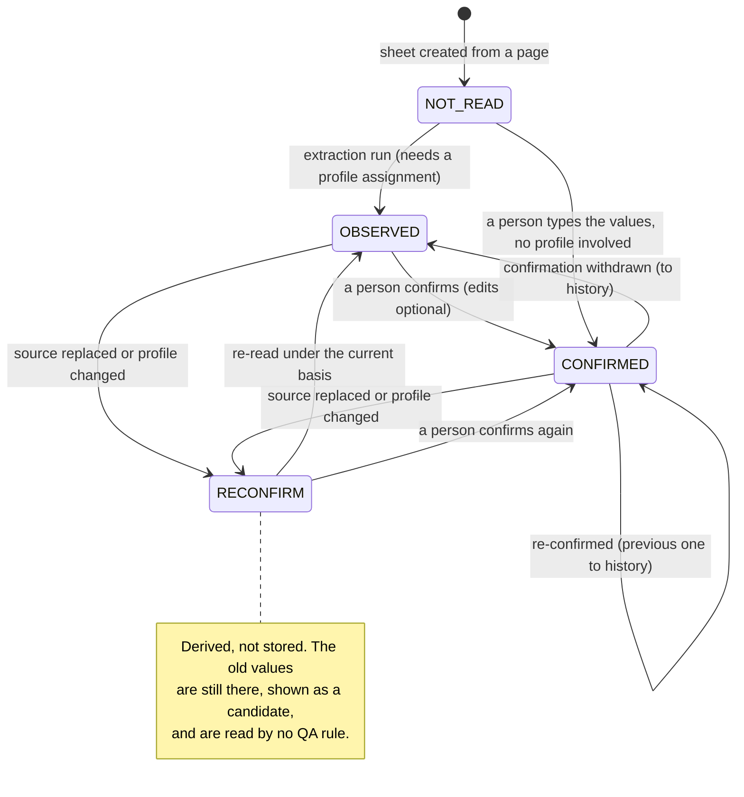
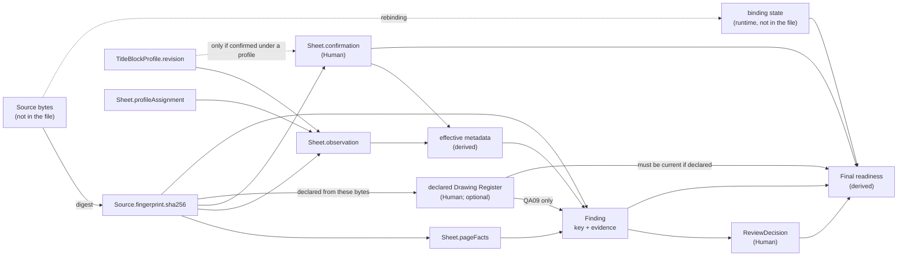

# Proposed data model and stale dependency (R5)

> **RESEARCH ONLY / NOT PRODUCTION / NOT CANONICAL.**
> A *proposed* conceptual model and a *proposed* logical model, for Independent Architecture Review.
> This is not a canonical ERD and adopts no schema. The machine-readable statement of the same model is
> `portable-project.schema.proposed.json` (structure) plus `prototype/semantic.mjs` (relations).
> The Data Model Gate stays **Class B** until a Human adopts otherwise — see §8.
>
> Revised after Independent Architecture Review of `4139133` (RF-33-02): an **optional, Human-declared
> Drawing Register** is added as two entity types (§2A), and the Data Model Gate timing is stated exactly (§8).

## 1. Proposed conceptual model

Ownership, as the Product Definition lists the candidate entities, with two additions research and review
suggest: Title Block Profile is an entity of the Drawing Set in its own right, because Sheets refer to it;
and a Drawing Set may carry a **declared Drawing Register**, because QA09 compares the Sheets with one.

Solid arrows are ownership; dashed arrows are references by id.

## 2. Proposed logical model

Persisted as **flat collections under the Drawing Set, related by id** — not as the nested tree above. A
nested file would bury a Sheet under its Source and a Decision under its Finding, which makes every reference
implicit and every integrity check a tree walk. Flat collections make each relation an explicit, checkable
foreign key, keep the document seven containers deep (measured; `maxNestingDepth` candidate 16), and are
what the import validator can bound. The one place a collection is nested is a register's rows, which belong
to exactly one reference for life and are never addressed except through it or by their own id.

Attributes are abbreviated; the schema file is the full statement.

## 2A. The declared Drawing Register (RF-33-02)

QA09 is "Human-declared Drawing Register / 図面一覧 vs actual Sheets". For that there has to be somewhere
for a declared register to live, and rules for how it comes to exist. The minimum that works:

### What it is

| | `DrawingRegisterReference` | `RegisterEntry` |
|---|---|---|
| **Is** | one list a person designated: a table on one page of one Source, and the rows they accepted from it | one row of that list: what the person declared it to say about one drawing |
| **Identity** | UUID | UUID |
| **Provenance** | `sourceId`, `pageNumber`, `region` (where the table was, upright points — the engine's own grid box), `sourceSha256` (the bytes), `method`, `declaredAt` | `row` (its position in the declared list), `origin`: `EXTRACTED` (as read), `EDITED` (corrected by a person), `MANUAL` (typed by a person) |
| **Values** | — | `drawingNumber` (required, non-empty); `drawingTitle`, `revision`, `issueDate` (each optional — `null` when the list does not state it) |
| **Cardinality** | 0..N per Drawing Set. **Zero is the normal case**: the register is optional. A list that runs over several pages is several references. | 1..N per reference |
| **Lifecycle** | created by a person's declaration; **its basis never changes**; retired when withdrawn, when its Source is retired, or when it is declared again | values may be corrected by a person in place (`origin` records that); retired when a person removes the row |

### Three rules

1. **A register exists only because a person declared one.** Nothing looks for a list. A list page being in
   the set, its text having been read, the table engine being able to reconstruct it — none of that creates a
   register. The act is: point at the table, map the columns, look at the rows, accept
   (`declareDrawingRegister`).
2. **Its basis is fixed.** A reference is bound to the bytes it was declared from, exactly as an observation
   is. If the Source is replaced the reference is `STALE` by comparison, QA09 is not evaluated, and a person
   declares the register again — which makes a **new** reference and retires the old one. A reference is
   never re-pointed at new bytes, so "which list did this decision refer to" always has one answer.
3. **Field-level rows only.** The persistence boundary of the Product Definition, applied here:

   | Kept | Not kept — and there is no property to keep it in |
   |---|---|
   | per row: drawing number, title, revision, date | the page image, or any image of the table |
   | where the table was (a rectangle) | the page's extracted text; the tokens the engine read |
   | which bytes, which page, when, by which method | the table's cell grid as a block; raw OCR text of the page |
   | whether a row was read, corrected or typed | a file path; PDF bytes; the engine's candidate or its score |

   `tests/declared-register.test.mjs` hangs page text, tokens, the grid, the candidate and a cell image on a
   register in memory and requires none of it to reach the file; a file that carries such a property is
   refused (`fixtures/invalid/register-with-page-text.json`).

### Entity or value object?

| | Verdict | Why |
|---|---|---|
| `DrawingRegisterReference` | **entity** | It has its own identity and lifecycle (declared, withdrawn, declared again), a foreign key to a Source, and findings depend on whether it is current. |
| `RegisterEntry` | **entity** — a stable UUID is justified | (i) A `LISTED_BUT_MISSING` finding is *about one row*, and a Human decision hangs off that finding; the relation Finding → entry has to survive other rows being added, corrected or removed, which a position in an array does not. (ii) A person corrects and removes rows one at a time. (iii) A removed row must stay resolvable for the findings that cited it — which means retiring it, and a thing that can be retired has an identity. |
| a row's four values | value object | They have no identity apart from their row. |
| `region` | value object | A rectangle. |

So the repair adds **two durable entity types**, taking the proposed model from eight to ten.

### Where the rows come from

The existing table engine (M2-4) reconstructs a table a person points at into a grid of cell text; an adapter
turns that grid into rows with one more piece of knowledge the person supplies — which column is the drawing
number (`reuse-audit.md`, candidate 13). The engine is not changed. Its table reconstruction
(`reconstructSelection`) is run for real from the tests, on a synthetic list page; reading a real PDF page
into the engine's input (`analysePageGeometry`) was not run (`limitations.md`). The engine reads native text
only, so a scanned list is declared by typing it (`method: MANUAL`).

**`region` is the origin of the rows, not the rectangle the person dragged.** The person's selection only
tells the engine where to look, and may take in margin or a neighbouring legend the engine leaves out; the
table the person designated is the grid the engine reconstructed inside it, and `region` is that grid's box
(`candidate.bbox`, the same upright page space as the profiles). That the person chose it is recorded by the
declaration itself — `method: TABLE_NATIVE` and `declaredAt` — not by a second rectangle. Only a register
read from a table must carry a `region` (`REGION_REQUIRED`; a file without one is refused at the relations
stage); one typed by hand (`MANUAL`) may have none.

### What is deliberately not modelled

| Not modelled | Why |
|---|---|
| A machine-observed register distinct from the declared one | The register is Human-declared by definition. What the table engine reads is a draft in the workspace until a person accepts it; it is not persisted. |
| A history of a reference's basis | A re-declaration is a new reference; the old one is retired and stays in the file. That is the history. |
| A register that is not on a page of a Source (an externally supplied list) | No such origin exists in the app today. It would be a second kind of provenance — Unresolved U-3. |
| Comparing a Sheet's title, revision or date with its row | The entries carry the values; QA09's minimum compares numbers only — Unresolved U-2. |
| The column mapping and the number of heading rows | They are how one declaration was made, not what was declared. A re-declaration is a Human act and makes its own. |

## 3. Data Model Contract minimum (Data Model Gate §3)

| Item | Proposed |
|---|---|
| **Entities** | Project, Drawing Set, Source (+ Source Fingerprint), Title Block Profile, Sheet, **Drawing Register Reference**, **Register Entry**, Analysis Run, QA Finding, Review Decision — ten |
| **Primary key** | An internal lower-case UUID on every entity. One namespace across all entity types: no id is used twice anywhere in a file (`REL_DUPLICATE_ID`). Minted from `crypto.getRandomValues`, because `crypto.randomUUID` does not exist in an insecure context (measured: `browser-probes.json`). |
| **Identity that is *not* the key** | `drawingNumber` is a property of a Sheet (adopted contract J) and of a Register Entry — and it is what QA09 *compares*, never what either *is*. `displayName` is a label. `sha256` is content identity — what binds bytes to a Source, not what a Source *is*: a Source keeps its id when a person accepts new bytes for it. |
| **Foreign keys** | `Sheet.sourceId`; `Sheet.profileAssignment.profileId`; `Sheet.observation.runId`; `*.profile.profileId`; `DrawingRegisterReference.sourceId`; `Finding.runId`, `.lifecycle.closedByRunId`, `.lifecycle.supersededByFindingId`, `.sheetIds[]`, `.sourceIds[]`, `.registerEntryIds[]`, `.basis[].sourceId`; `ReviewDecision.findingId`. Every one must resolve, or the file is refused whole. |
| **Cardinality** | Project 1:1 Drawing Set (M7). Drawing Set 1:N of each collection (0..N for the register). Source 1:N Sheet; Source 1:N Register Reference. Register Reference 1:N (≥ 1) Register Entry. Profile 1:N Sheet (0..1 per Sheet). Finding N:M Sheet, N:M Source, N:M Register Entry. Finding 1:N Decision. Finding 0..1 → Finding (supersession). |
| **Required / optional** | Every property the schema lists as `required` is present, with `null` for "not yet" or "not stated" (`pageFacts`, `profileAssignment`, `observation`, `confirmation`, `retiredAt`, `completedAt`, lifecycle fields, a register's `region`, a row's title / revision / date). There is no "absent means default". |
| **Uniqueness** | id (global); `sha256` among live Sources; `(sourceId, pageNumber)` among live Sheets; `row` within one Register Reference; one `ACTIVE` Finding per `findingKey`; `sequence` 1..n per Finding. |
| **Ownership** | The Drawing Set owns every collection. A Sheet belongs to exactly one Source for life. A Register Entry belongs to exactly one Register Reference for life. A Decision belongs to exactly one Finding for life. |
| **Delete behaviour** | **Nothing is deleted.** A Source, Sheet, Profile, Register Reference or Register Entry a person removes is *retired* (`retiredAt`), stays in the file, and keeps every reference to it valid. Retiring a Source retires its Sheets and its Register References. A replaced fingerprint or confirmation moves to its history list. A Finding is never removed to resolve it (adopted contract K): it becomes `SUPERSEDED` or `NOT_REPRODUCED`. The one exception is an Analysis Run that nothing refers to any more, which carries no information and is pruned at save. |
| **Lifecycle** | §2A, §4–§6. |
| **Permission boundary** | None in M7: no accounts, no server (adopted contract D). A Decision therefore records no author — Unresolved U-9. |

## 4. Bases: how a derived record is bound to what it came from

Every derived record states its **basis** — the exact inputs it was derived from. Nothing is marked stale;
a record *is* stale when its basis no longer equals what is there now. This is the whole stale mechanism.

| Record | Basis it carries | Stale when |
|---|---|---|
| `Sheet.pageFacts` | `sourceSha256` | ≠ the Source's current fingerprint |
| `Sheet.observation` | `sourceSha256`, `profile { profileId, profileRevision }`, `runId` | fingerprint differs → `STALE_SOURCE`; the sheet is no longer assigned that profile, or the profile's revision moved → `STALE_PROFILE` |
| `Sheet.confirmation` | `sourceSha256`, `profile` (or `null` if confirmed with no profile involved) | same two tests; a confirmation made without a profile is untouched by profile changes |
| `DrawingRegisterReference` | `sourceSha256` of the Source it was declared from | ≠ that Source's current fingerprint, or the Source is retired → the declared register is `STALE` and QA09 is not evaluated |
| `Finding` | `basis[] { sourceId, sha256 }` for every Source it cites — through a Sheet, directly, or through a Register Entry's reference; and `evidenceDigest` over (rule version, cited sheets with their fingerprints, cited register entries, the values that make it true) | any cited fingerprint differs; a cited Source, Sheet or Register Entry was retired; for QA09, the declared register is not current |
| `AnalysisRun` | `manifestDigest` = SHA-256 of the sorted `(sourceId, sha256)` pairs of every live Source | informational: says which exact set of bytes a run saw |
| `ReviewDecision` | `evidenceDigest`, which must equal its Finding's | never stale itself; it is *about* one immutable statement |

Why a digest on the run instead of a list: with one PDF per sheet, listing every Source's fingerprint on
every run adds about 650 KB to a 5000-sheet file per run (5000 × ≈ 130 bytes; computed, not measured). The
digest binds a run to the same set of bytes in 64 characters, and the exact per-Source binding lives on each
record that cites a Source.

### Analysis Run ↔ Source fingerprint

- An **extraction** run stamps each observation with the `sourceSha256` it actually read.
- A **QA** run stamps each finding with the fingerprints of the Sources it cites, and itself with the
  `manifestDigest`.
- At analysis time the bytes are re-digested and compared with the bound fingerprint before anything is
  read from them (recommendation B) — the rule Split / Merge already follows (RF-R4-5).

## 5. Sheet metadata: machine-observed vs Human-confirmed

- **The two are stored side by side and never merged.** `observation` is what the machine read;
  `confirmation` is what a person stands behind. A correction does not overwrite the machine's reading
  (`tests/qa-rules.test.mjs`, "a confirmed value overrides the observed one…").
- **A score never confirms anything** — the existing register's rule, kept. `ocrScore` is stored as a sort
  key and is read by nothing that decides.
- **What a QA rule reads** ("effective" values): the confirmation if it stands; else the observation if it
  stands; else nothing — and a sheet with nothing is reported by QA02 rather than guessed at.
- **Human-confirmed metadata as a re-confirmation candidate.** When the Source is replaced the confirmation
  is not erased and not trusted: its basis no longer matches, so it is shown as "previously confirmed" and
  the sheet goes back to needing a person. Re-confirming moves the old one to `confirmationHistory`
  (`RECONFIRMED`). That is how a Human comment or value survives a Source change as history.
- **The metadata-confirmation requirement is lifted from a sheet only by an `INTENTIONAL` decision on its
  QA02 finding** — never by `FALSE_POSITIVE`, `ACTION_REQUIRED` or `HOLD` (RF-33-01; `qa-rule-matrix.md`
  QA02; `tests/final-readiness.test.mjs`).

## 6. Finding and Decision: stale, current, superseded

Two axes, deliberately separate.

**Stored — `lifecycle.state`** (what later runs have said about this statement):

| State | Meaning |
|---|---|
| `ACTIVE` | The latest statement of this question. |
| `SUPERSEDED` | A later run stated the same question (`findingKey`) on different evidence; `supersededByFindingId` points at it. |
| `NOT_REPRODUCED` | A later run that *could* evaluate the question no longer found it. |

**Derived — currency** (can this statement be believed right now):

| Currency | Meaning |
|---|---|
| `CURRENT` | `ACTIVE`, its basis equals the manifest, its Sources are `MATCHED` this session, and (for a set-wide rule) the whole set could be evaluated. |
| `UNVERIFIED` | `ACTIVE` and consistent with the manifest, but a cited Source is not bound, or the set is not fully evaluable. |
| `STALE` | `ACTIVE`, but stated about bytes the Source no longer has, about a retired Sheet or Register Entry, or (QA09) against a declared register that is no longer current or has been withdrawn. |
| `HISTORICAL` | Not `ACTIVE`. |

```mermaid
stateDiagram-v2
    [*] --> ACTIVE: a QA run states it
    ACTIVE --> ACTIVE: later run, same key, same evidence (nothing written)
    ACTIVE --> SUPERSEDED: later run, same key, different evidence
    ACTIVE --> NOT_REPRODUCED: later run could evaluate it and did not find it
    ACTIVE --> ACTIVE: later run could NOT evaluate it (left as is; derived STALE)
    SUPERSEDED --> [*]
    NOT_REPRODUCED --> [*]
```

**Does a Review Decision depend on the Finding version? Yes — by construction.** A Finding is immutable
apart from its lifecycle; a changed statement is a *new* Finding. A Decision names a `findingId` and repeats
that Finding's `evidenceDigest`, and import refuses a Decision whose digest is not its Finding's
(`REL_DECISION_EVIDENCE`). So:

- same question, same evidence on the next run → the same Finding, and the Decision stands;
- same question, different evidence (a third sheet joins a duplicate; the Source was replaced; the register
  was declared again) → a new Finding with no Decision, and the old Decision stays attached to the old
  Finding as history (`tests/qa-rules.test.mjs`, "changed evidence supersedes…"; `tests/stale.test.mjs`,
  "re-reading and re-confirming…"; `tests/declared-register.test.mjs`, "declaring the register again…");
- a person changes their mind → a new Decision with the next `sequence`; the earlier one stays.

A Decision is never edited, moved, or deleted by anything in the prototype. The effective Decision of a
Finding is the one with the highest `sequence`.

**A finding in a file is recognised, never believed.** QA is re-evaluated when a Project is opened (it costs
milliseconds), and the findings in the file are matched against the fresh result by key and evidence. A
well-formed finding that the metadata does not support is closed by that first run
(`tests/qa-rules.test.mjs`, "a forged one is closed by the first run"). What the file contributes is
identity and Human history, not truth. The declared register is the one input here that *is* believed as
written — because a person wrote it, not a machine.

## 7. Dependency graph

Expensive edges (they need the PDF) are the ones out of **Source bytes**. Everything to the right of
*effective metadata* is recomputed from data already in the model. That split is why a Source change can
leave data stale for a while and a metadata edit cannot.

## 8. Data Model Gate re-evaluation

**Current:** Class B — ERD Candidate (Product Definition v1, principle 11). This research does not change it.

**Recommended: Class A — ERD Recommended — taking effect at Human Architecture Adoption.**

Against the Gate's own A-criteria (`Data_Model_Gate.md` §4B, "A判定の目安"), every one holds for the model
this research proposes, and the declared Drawing Register strengthens the case rather than changing it:

| Gate criterion | In the proposed model |
|---|---|
| Several persistent entities / artifacts | **Ten** entity types in one durable artifact (eight before RF-33-02; Drawing Register Reference and Register Entry added) |
| 1:1 / 1:N / N:M relations | All three (§3); Finding now relates N:M to three entity types |
| References by id / FK / content hash / immutable reference | UUID foreign keys throughout; SHA-256 content identity; immutable Findings; a register reference with a fixed basis |
| History / revision / run / evidence / state transition | `fingerprintHistory`, `confirmationHistory`, append-only Decisions, Analysis Runs, Finding lifecycle, register re-declaration by retire-and-replace |
| Ownership / lifecycle / append-only / create-once is central to the contract | Retire-never-delete, append-only Decisions, one-ACTIVE-per-key, declare-once register basis |
| A coding agent misreading the structure causes serious drift | The stale mechanism, decision carry-over, rebinding and QA09's evaluability all rest on which record carries which basis |

And the Gate's B → A trigger ("validation-only concept が実際の durable artifact model になった") is exactly
what Human Adoption of a Portable Project schema would be. The Gate also says a database is not required:
"JSON … でも、relation が canonical contract なら A になり得る".

### Timing — stated exactly

| When | What is true |
|---|---|
| **Now** (this research, and Independent Review of it) | Class **B**. Nothing here is canonical. The schema is a proposal, the diagrams above are proposed projections, and the Gate says not to draw a future entity's ERD ahead of its adoption. |
| **At Human Architecture Adoption** | The Data Model moves **B → A**. The adopted **machine-readable schema together with its semantic relation contract become the canonical source** (Gate §2: a machine-readable model, not a diagram; the Mermaid diagrams are projections of it). |
| **Before M7-P1 implementation starts** | That canonical contract **already exists**. P1 is implemented *against* it (`data_model_impact: NEW` for the first Production M7 PR), not ahead of it. |
| **During P1–P3** | No Portable Project file has shipped to anyone, so the schema is **pre-release** and may evolve **without an end-user migration**. It may *not* evolve informally: **any semantic change of shape — an entity, a relation, a key, nullability, a lifecycle rule — updates the canonical contract first and passes review**, exactly as the Gate's implementation order requires (requirement → impact → canonical contract → projection → implementation). The in-memory model in P1–P3 does not drift from the adopted model and get reconciled at P4. |
| **At M7-P4 (the first release that writes a file)** | `schemaVersion: 1` is fixed. From then on a change of shape is a new version with a migration (§4 of the main document). |

So "the format can still change before P4" means *the canonical contract can be revised, under review,
without a migration* — it does not mean implementation may run ahead of the contract.
