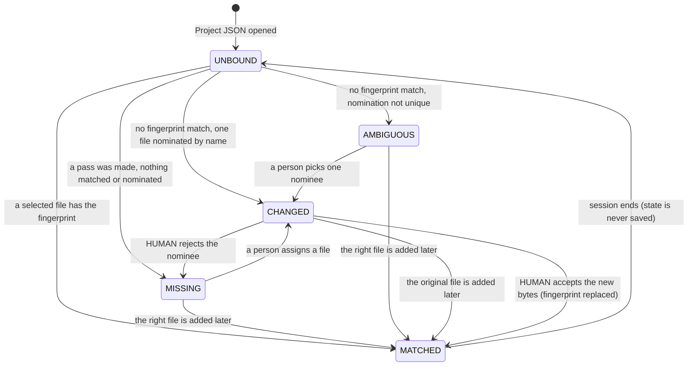

# Source rebinding state machine (R2)

> **RESEARCH ONLY / NOT PRODUCTION / NOT CANONICAL.**
> A proposal for Independent Architecture Review. Nothing here is adopted.
> Prototype: `prototype/rebind.mjs`, `prototype/currency.mjs`. Tests: `tests/rebind.test.mjs`, `tests/stale.test.mjs`.

A Portable Project JSON holds no bytes and no paths (Product Definition v1, F). On resume every Source is a
description waiting for a file, and this is the algorithm that decides which selected file is which Source.

## 1. One rule, one hint

| | What it is | What it can produce |
|---|---|---|
| **Rule** | SHA-256 equality between a selected file and a Source's recorded fingerprint | `MATCHED`, and nothing else produces it |
| **Hint** | File-name equality (NFC, case-folded) | a *nomination* for `CHANGED` or `AMBIGUOUS`; never `MATCHED` |

The name is not identity and is never used as one. It exists only so that "the same file name with different
bytes" can be offered to a person as *probably the new version of this Source* instead of as an unrelated file.

## 2. States

All five are **runtime** states. None is stored in the Project JSON: a saved file records what the bytes
*were* (the fingerprint), never whether they are in hand now.

| State | Meaning | How it is reached |
|---|---|---|
| `UNBOUND` | Nobody has looked yet. | Every Source on resume, before any file is selected. |
| `MATCHED` | A selected file has this Source's exact fingerprint. | Pass 1. |
| `CHANGED` | No selected file has the fingerprint; exactly one file is nominated. | Pass 2 (name), or a person's explicit assignment. |
| `AMBIGUOUS` | No selected file has the fingerprint; the nomination is not unique. | Pass 2. |
| `MISSING` | A pass was made; nothing matched and nothing was nominated. | Pass 2. |

`UNBOUND` and `MISSING` both mean "no bytes". The difference is whether that is *known*: `UNBOUND` is the
absence of an attempt, `MISSING` is the result of one. QA10 treats them differently for that reason — a
Source nobody has looked for yet is not an abnormality (`tests/qa-rules.test.mjs`, "QA10 does not call an
unlooked-for source abnormal").

## 3. Algorithm

Input: the live manifest Sources; the selected files as `{candidateId, name, byteLength, sha256}`; a person's
explicit assignments `{sourceId, candidateId}`. Output: one state per Source, notices, and the files left
over. It is a pure function — it reads the manifest and changes nothing
(`tests/rebind.test.mjs`, "rebinding reads the manifest and changes nothing").

1. **No candidates** → every Source `UNBOUND`.
2. **Pass 1 — fingerprint.** For each Source, if any candidate has its `sha256` → `MATCHED`, bound to the
   first such candidate. Every candidate with that hash is *spent*: identical bytes are interchangeable, so
   which copy is bound cannot matter, and a spare copy is reported (`REDUNDANT_COPY`) rather than bound to
   something else or left over as a "new" file. If the bound file's name differs from `displayName` →
   notice `RENAMED`.
3. **Explicit assignments.** For each still-unmatched Source a person assigned an unspent candidate to →
   `CHANGED` (`nominatedBy: HUMAN`). An assignment can never make `MATCHED` and can never take a file that
   Pass 1 already bound.
4. **Pass 2 — name hint.** For each remaining Source, let *F* be the unspent candidates with its name and
   *S* the remaining Sources with that name:
   - `|F| = 0` → `MISSING`
   - `|F| = 1` and `|S| = 1` → `CHANGED` (`nominatedBy: NAME`)
   - otherwise → `AMBIGUOUS`, with every member of *F* listed as a nominee
5. Candidates neither spent nor nominated are returned as **unassigned**. They are not errors: a person may
   add one as a new Source or assign it to a `MISSING` Source.

The result does not depend on the order files were selected in, and adding files later can only improve a
binding (both tested).

**Optimisation, not semantics:** a file whose `byteLength` equals no Source's cannot have a Source's
fingerprint, so it need not be read to know it cannot be `MATCHED` (`candidatesWorthHashing`). It can still
be nominated by name, and is fingerprinted when a person accepts it.

## 4. The seven cases of the Task Packet

| # | Situation | Result | Test |
|---|---|---|---|
| 1 | same file name, same bytes | `MATCHED` | case 1 |
| 2 | renamed file, same bytes | `MATCHED`, notice `RENAMED` | case 2 |
| 3 | same file name, different bytes | `CHANGED` — never `MATCHED` | case 3 |
| 4 | source not selected | `UNBOUND` before any pass, `MISSING` after one | case 4 |
| 5 | multiple candidates | `AMBIGUOUS`; no guess is made | case 5 (two variants) |
| 6 | duplicate physical files with one hash | `MATCHED` to the first; notice `REDUNDANT_COPY`; no leftover | case 6 |
| 7 | one of several source PDFs changed | per-Source: the others `MATCHED`, that one `CHANGED` | case 7 |

Case 2 is `MATCHED`, not a "MATCHED candidate" awaiting confirmation. The adopted contract makes SHA-256 the
authoritative match evidence (G); asking a person to confirm what the fingerprint has already proved would
add a step and no information. The rename is *shown* (notice), and the manifest's `displayName` can follow
the new name at the next save.

### Case 6 — what identity means for identical bytes

Two different things can be "duplicate":

- **Two selected files with the same bytes** (`a.pdf` and `a - Copy.pdf`): one content. Bound once; the
  spare is reported.
- **Two manifest Sources with the same bytes**: not allowed to exist. Within one Drawing Set the fingerprint
  is unique among live Sources — enforced when a Source is added (`DUPLICATE_CONTENT`), when a fingerprint is
  replaced, and on import (`REL_DUPLICATE_SOURCE_CONTENT`). Admitting the same bytes as two Sources would
  manufacture a duplicate drawing number for every sheet and leave rebinding nothing to tell the two slots
  apart by.

So a fingerprint identifies at most one live Source, and Pass 1 is never ambiguous. `AMBIGUOUS` arises only
from the name hint.

## 5. CHANGED is a question for a person

`CHANGED` binds nothing. It offers a nominee, and the three answers have different consequences:

| Human action | Effect on the model | Effect on derived data |
|---|---|---|
| **Accept as the new content of this Source** | current fingerprint → `fingerprintHistory` (`REPLACED_BY_HUMAN`); new fingerprint installed; Sheets are added for pages the new file adds | everything read from the old bytes is stale *by comparison* from this moment (§6); nothing is erased |
| **Not this Source** | nothing | Source → `MISSING`; the file returns to *unassigned* |
| **Add as a new Source instead** | a new Source and its Sheets | the old Source stays `MISSING` until resolved or retired |

On acceptance, page *n* of the new file is treated as the same Sheet as page *n* of the old one — **as a
candidate only**. Nothing about that Sheet is trusted until it has been re-read and a person has re-confirmed
it. If the new file is shorter, the Sheets whose pages are gone are **not** retired automatically: QA09
reports them (`SHEET_WITHOUT_PAGE`) and a person retires them (`tests/stale.test.mjs`, "a replacement with a
different page count…"). Whether same-position is the right default when pages were *inserted* is a real
limitation — see Unresolved U-4 in `architecture-research.md`. Matching sheets across revisions is M8's
subject, not M7's.

## 6. What a change makes stale — the dependency matrix

Staleness is **computed, not stored** (`prototype/currency.mjs`). Every derived record names what it was
derived from; it is stale when that is no longer what is there. So the scope of a change is exactly the set
of records that name the changed thing, and one changed Source cannot stale the whole Project.

| Change ↓ / Data → | Page facts (size, rotation) | Observation (machine-read fields) | Confirmation (Human) | Findings citing those sheets | Set-wide findings (gap, size / orientation outlier) | Other Sources | Decisions |
|---|---|---|---|---|---|---|---|
| **Source content replaced** | STALE | STALE | RE-CONFIRM (kept, not trusted) | STALE | UNVERIFIED until the set is re-evaluated in full | untouched | kept as history |
| **Source renamed, same bytes** | — | — | — | — | — | — | — |
| **Source not provided this session** | UNVERIFIED | UNVERIFIED | UNVERIFIED | UNVERIFIED | untouched | untouched | in force, unverified |
| **Profile geometry or model changed** | — | STALE (that profile's sheets) | RE-CONFIRM, unless made with no profile | re-evaluated | re-evaluated | untouched | kept if evidence unchanged |
| **Sheet moved to another profile** | — | STALE (that sheet) | RE-CONFIRM, unless made with no profile | re-evaluated | re-evaluated | untouched | kept if evidence unchanged |
| **Sheet metadata confirmed / edited** | — | — | replaced; old one to history | re-evaluated | re-evaluated | untouched | kept if evidence unchanged |
| **Source added / retired** | — | — | — | re-evaluated | re-evaluated | untouched | kept if evidence unchanged |

The same table is `STALE_MATRIX` in `prototype/currency.mjs`, and `tests/stale.test.mjs` holds the prototype
to it one row at a time. Three distinctions in it carry weight:

- **STALE vs UNVERIFIED.** `STALE` means the record contradicts the manifest: it was read from bytes the
  Source no longer has. `UNVERIFIED` means the record agrees with the manifest but the bytes are not in hand
  to check. A missing file makes nothing stale.
- **"Re-evaluated" is not "stale".** The QA rules read only metadata and re-run in milliseconds
  (`benchmark/results/`), so a metadata change is followed by a fresh evaluation, not by a waiting state.
  Staleness has to be *waited out* only where recovering costs a read of the PDF.
- **A run does not close what it could not look at.** While a replaced Source's sheets are waiting to be
  re-read, findings about them are neither re-stated nor declared gone; they stay `ACTIVE` and are `STALE`
  (`tests/stale.test.mjs`, "after a replacement, a QA run does not close what it could not look at").

### Per-scope summary (the four the Task Packet names)

| Scope | Example | Goes stale when |
|---|---|---|
| per-sheet metadata | a sheet's confirmed drawing number | that sheet's Source content is replaced; or (if profile-based) its profile changes |
| per-source derived result | observations and page facts of one PDF | that Source's content is replaced |
| whole-drawing-set QA | "is every finding reviewed" | never stale as such: recomputed on every change |
| set-wide result | duplicate number, gap, outlier | evidence cites a replaced sheet → STALE; set not fully evaluable → UNVERIFIED |

## 7. Files that change underneath the session

Observed in Chrome 143 (`benchmark/results/browser-probes.json`, `fileChangedOnDiskAfterSelection`): a
`File` whose file on disk was appended to, overwritten at the same size, or deleted after selection can no
longer be read at all — `NotReadableError` / `NotFoundError` from `slice()`, `arrayBuffer()` and a streamed
read alike. The page therefore does not silently receive different bytes; it receives a read error, which
the workspace should surface as "this Source needs to be selected again" (back to `UNBOUND` for that Source).

That is one browser's behaviour and it rests on the file's modification time. It is not the guarantee. The
guarantee is the one Split / Merge already uses (`src/utils/split-merge/digest.ts`, RF-R4-5): **the digest is
recomputed over the bytes an analysis actually loads, and a mismatch is refused.** Recommendation B in
`architecture-research.md` carries that rule into M7.
