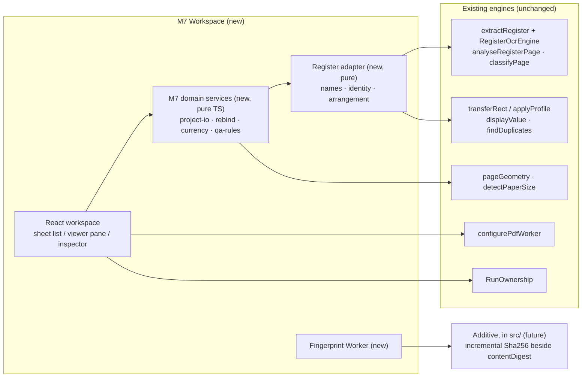

# Existing-engine reuse audit (R6)

> **RESEARCH ONLY / NOT PRODUCTION / NOT CANONICAL.**
> A read-only audit of `main` at `1b5f9eda59a583a6b8fe7e07013ba38fc3053d1f`. No file under `src/` was changed.
> Nothing here is adopted, and no Production refactor is proposed for *this* task.

The question is not "can M7 embed the existing screens" — it is assumed it cannot — but: which existing
**engines** can M7 reach across a domain / service boundary, and what stands in the way of each.

```text
existing engine  →  domain / service boundary (adapter)  →  M7 Workspace
```

## How this audit was made

| Source of each statement | Marked |
|---|---|
| Read in full by the Orchestrator and/or **executed** from the research harness against Production code | **verified** |
| Collected by two read-only sub-agents (file inventory, signatures, call sites), then spot-checked here with `grep` | *audited* |

Executed means `tests/reuse-parity.test.mjs` and `tests/sha256.test.mjs` import the Production module from
`src/` unchanged and call it. That covers `drawing-register-template.ts`, `drawing-register.ts`,
`drawing-register-types.ts`, `comparator/geometry.ts`, `page-size-normalizer.ts` (pure parts) and
`split-merge/digest.ts`. Line numbers are given only where they were checked here.

## 1. Summary

| # | Candidate | Verdict | Reaches M7 through |
|---|---|---|---|
| 1 | Drawing Register — extraction orchestration | **Reuse, adapter only** | an adapter that maps M7 Sheets / Profiles to its per-document inputs |
| 2 | Drawing Register — profile and transfer geometry | **Reuse as is** | a field-name mapping (tested) |
| 3 | Drawing Register — row / review domain | **Reuse selectively** | `displayValue`, `findDuplicates`; M7 owns confirmation and lifecycle |
| 4 | Native text — register tokens | **Reuse via 1** | — |
| 4b | Native text — whole-document extraction | **Do not use** | returns full page text; M7 must not hold or persist it |
| 5 | OCR | **Reuse via 1** | `RegisterOcrEngine`; M7 owns the worker's lifetime |
| 6 | Page classification | **Reuse via 1** | — |
| 7 | PDF.js runtime setup | **Reuse as is** | `configurePdfWorker()` |
| 7b | PDF viewer component | **Do not reuse** | it is the annotator; M7 needs its own viewer pane |
| 8 | Split / Merge — digest | **Reuse the algorithm; needs an incremental form** | *future refactor* |
| 8b | Split / Merge — Load Boundary | **Open question** | Unresolved U-7 |
| 8c | Split / Merge — Worker pattern, run ownership | **Reuse the pattern**; `RunOwnership` as is | — |
| 9 | Comparator — page geometry | **Reuse as is** | `pageGeometry` (tested) |
| 9b | Comparator — source handling | **Do not reuse** | it is component code with no bounds and no cleanup |
| 10 | Page size / orientation | **Reuse the pure helper**; the reader needs extracting | `detectPaperSize` (tested); *small future refactor* |
| 11 | Title-block **updater** | **Not applicable** | a writer, in a different coordinate space |
| 12 | App shell / tool registration | **Small edit at implementation time** | not an engine |

No candidate needs a refactor *before* M7 can start. Two need one *for* M7 (8, 10), and both are additive.

## 2. The table the Task Packet asks for

Columns: **API** · **Pure / UI** (pure domain logic or UI-bound) · **Browser state** · **React** ·
**PDF.js objects** · **Cancel** · **Memory ownership** · **M7 reuse** · **Adapter only?** · **Future refactor?**

### 1. Drawing Register — extraction orchestration

| | |
|---|---|
| **Path** | `src/utils/pdf-textifier/drawing-register-extract.ts` (re-exported by `pdf-textifier/index.ts`) |
| **API** | `extractRegister(options: ExtractOptions): Promise<RegisterExtractionResult>`; `ExtractOptions { doc: PDFDocumentProxy; profiles: Map<string, TemplateProfile>; assignments: AssignmentSet; ocr: RegisterOcrEngine; sourceRevision?; dpi?; shouldCancel?: () => boolean; onProgress?: (pageNumber, total) => void }` — **verified** (signature lines 29–55) |
| **Pure / UI** | Orchestration with no React and no DOM of its own. It needs a DOM indirectly: OCR regions are rendered to an `HTMLCanvasElement`. |
| **Browser state** | None of its own. One `import.meta.env?.DEV` read. |
| **React** | None. The only React consumer is `DrawingRegisterExporter.tsx`. |
| **PDF.js objects** | Takes a `PDFDocumentProxy` it does **not** own. Returns plain data. |
| **Cancel** | `shouldCancel` polled before each page, after geometry, and before the row is kept (lines 66, 82, 128 — **verified**); throws a plain `Error('cancelled')`. An OCR recognition already in flight is not interruptible. No `AbortSignal`. |
| **Memory** | The caller owns and destroys the document and owns and terminates the OCR engine. Pages are cleaned up in `finally`. Per-page tokens are local to the loop and are not returned. |
| **M7 reuse** | **Yes.** It already runs outside React — `scripts/smoke-drawing-register-harness.html` drives it from a plain module script (*audited*). |
| **Adapter only?** | **Yes.** One call per bound Source. `prototype/register-adapter.mjs` is that adapter as pure mappings: `engineInputsForSource` (Sheets → page assignments, Profiles → `TemplateProfile` map) and `observationFromRow` (row → observation). |
| **Future refactor?** | Not required. Two things M7 would *like*, neither blocking: an **engine version constant** (there is none in `pdf-textifier`, and the proposed schema records one per run), and cancellation as a typed error rather than a message string. |

### 2. Drawing Register — profile and transfer geometry

| | |
|---|---|
| **Path** | `src/utils/pdf-textifier/drawing-register-template.ts`, `drawing-register-types.ts` |
| **API** | `createProfile`, `missingFields`, `transferRect(rect, from, to, model)`, `applyProfile(profile, page)`, `unionRect`, `class AssignmentSet`, `parsePageRange`; types `TemplateProfile`, `TransferModel = 'normalised' \| 'corner-anchored'`, `PageAssignment`, `REGISTER_FIELDS` |
| **Pure / UI** | **Pure.** Plain numbers in, plain numbers out. — **verified, executed** |
| **Browser state** | A module-level counter for profile ids (`profile-N`, unique per page load only) and `Date.now()`. |
| **React** | None. |
| **PDF.js objects** | None. |
| **Cancel** | Not applicable. |
| **Memory** | Plain objects; rectangles are copied on `createProfile`. |
| **M7 reuse** | **Yes, as is.** |
| **Adapter only?** | **Yes** — a field-name mapping and nothing else. `tests/reuse-parity.test.mjs` saves a profile through an M7 Project file, loads it, and requires `applyProfile` to place every rectangle **identically** (not approximately) to the engine's own profile, for both transfer models and five page sizes. |
| **Future refactor?** | None. M7 mints its own UUIDs; the `profile-N` ids are never persisted. |

### 3. Drawing Register — row / review domain

| | |
|---|---|
| **Path** | `src/utils/pdf-textifier/drawing-register.ts` |
| **API** | `displayValue`, `buildRow`, `emptyRow`, `findDuplicates`, `annotateRegister`, `reviewSurface`, `attentionQueue`, `confirmRow`, `invalidateRow`, `exportReadiness`, `registerGrid`, `buildRegisterWorkbook`, `registerSummary` |
| **Pure / UI** | **Pure**, except `buildRegisterWorkbook` (builds an `.xlsx` through `./excel`). — **verified, executed** |
| **Browser state / React / PDF.js** | None. |
| **M7 reuse** | **Selectively.** `displayValue` (the proposed value from raw text) and `findDuplicates` (QA01's exact semantics) are used as they are — the parity test requires QA01 to report exactly the groups `findDuplicates` reports. `confirmRow` / `exportReadiness` / `sourceRevision` are **not** adopted: they implement a single-document, single-session lifecycle with one arrangement counter, and M7's is per profile, durable, and append-only. |
| **Adapter only?** | Yes for what is reused. |
| **Future refactor?** | None. M7's lifecycle is new code, not a change to this file. |

### 4. Native text extraction

| | Register tokens | Whole-document text |
|---|---|---|
| **Path** | `table-geometry.ts` (`readTokens`), `drawing-register-geometry.ts` (`analyseRegisterPage`, `tokensToRawText`) — **verified** | `pdf-textifier/extract.ts` (`extractTextPdf`) — *audited* |
| **API** | `analyseRegisterPage(doc, pageNumber): Promise<RegisterPageGeometry>`; `tokensToRawText(tokens, rect): string` | `extractTextPdf(file \| ArrayBuffer, options): Promise<TextExtractionResult>` |
| **Pure / UI** | `tokensToRawText` pure; `analyseRegisterPage` needs PDF.js only | orchestration; DOM for scanned pages |
| **PDF.js objects** | `PDFDocumentProxy` in, plain data out | opens and keeps its own document |
| **Cancel** | none | `shouldCancel` |
| **Memory** | opens and cleans up its own page; returns **every text run of the page** to its caller | accumulates and **returns the full text of every page** |
| **M7 reuse** | **Via candidate 1.** M7 never calls these directly, and the page's tokens never leave `extractRegister`. | **No.** Adopted contract F forbids persisting full extracted text; M7 has no use for it and should not hold it. |

### 5. OCR

| | |
|---|---|
| **Path** | `src/utils/pdf-textifier/ocr.ts` (`OcrEngine`), `drawing-register-ocr.ts` (`RegisterOcrEngine`) — *audited*; asset paths **verified** (`ocr.ts` 15–17) |
| **API** | `class RegisterOcrEngine { constructor(langs = 'jpn+eng'); start(); terminate(); recogniseFields(page, rects, { dpi?, rotation?, timeoutMs? }): Promise<RegionRecognition> }` |
| **Pure / UI** | **DOM-bound**: renders a region to an `HTMLCanvasElement` and passes a PNG data URL to the recogniser. |
| **Browser state** | A tesseract.js Web Worker per engine instance. Assets are same-origin (`/ocr/tesseract/`, `/ocr/tessdata`), never a CDN. No module-level singleton. |
| **React** | None. |
| **PDF.js objects** | Takes a `PDFPageProxy`. |
| **Cancel** | None in flight: "cancelling means discarding the whole worker". A 120 s per-page timeout tears the worker down. |
| **Memory** | The owner terminates the engine. Region canvases are released per call. Recognised words outside every field rectangle are returned to `extractRegister` and **discarded there** — only per-field `rawText` survives. |
| **M7 reuse** | **Via candidate 1.** OCR is one call per page over the union of the fields that need it, which is what makes a large set affordable; M7 inherits that. |
| **Adapter only?** | Yes. M7 creates one engine per extraction run and terminates it. |
| **Future refactor?** | None needed. Cancellation latency of a running recognition is a limitation M7 inherits (≤ one page). |

### 6. Page classification

| | |
|---|---|
| **Path** | `src/utils/pdf-textifier/classify.ts` — **verified** (`classifyPage`, lines 35–42) |
| **API** | `classifyPage(page): Promise<PageClassification>`; `classifyDocument(doc, onPage?)`; `PageKind = 'text-native' \| 'scanned'` |
| **Pure / UI** | PDF.js only; no DOM, no React. A character count inside an inset of `page.view`. |
| **M7 reuse** | **Via candidate 1** (`analyseRegisterPage` calls it and reports `scanned`). M7 stores it as `pageFacts.kind`. It is context, not a gate — the register deliberately reads a vector drawing number on a raster sheet. |
| **Future refactor?** | Optional: `analyseRegisterPage` fetches a page's text content twice (once here, once for tokens). A cost, not a correctness issue. |

### 7. PDF.js runtime and viewer

| | Runtime setup | Viewer component |
|---|---|---|
| **Path** | `src/utils/pdf-worker-source.ts` (and a second copy in `pdf-textifier/pdf-source.ts`) — **verified** (two writers of `GlobalWorkerOptions.workerSrc`) | `src/components/PdfViewer.tsx`, `PdfPage.tsx` — *audited* |
| **API** | `configurePdfWorker(): void`, `PDF_WORKER_URL = '/pdf.worker.min.mjs'` | `PdfViewer` (props: `onLoad?`), `PdfPage` (requires layers, tool, colour, measurement scale…) |
| **Pure / UI** | sets one global | React components |
| **Browser state** | **a process-wide global several modules write**; the rule is "call it immediately before `getDocument`" | component state; `PdfPage` imports `Layer` from `PdfViewer` and embeds `DrawingCanvas` |
| **Cancel / memory** | — | mounts **every** page (no virtualisation); `PdfViewer.tsx` never calls `destroy()` (0 occurrences — **verified**); keeps three copies of the bytes transiently |
| **M7 reuse** | **Yes, as is.** | **No.** It is the annotator, not a viewer: its page component cannot be mounted without annotation state. |
| **Future refactor?** | none | M7 needs a **read-only viewer pane of its own** (one page at a time, `page.cleanup()`, `doc.destroy()` on Source change). Extracting a shared viewer from the annotator is a possible later consolidation and is **not** a precondition. |

### 8. Split / Merge — digest, Load Boundary, Worker, ownership

| | Digest | Load Boundary | Worker client / ownership |
|---|---|---|---|
| **Path** | `src/utils/split-merge/digest.ts` — **verified, executed** | `src/utils/split-merge/load-boundary.ts`, `policy.ts` — *audited*; limits **verified** (`policy.ts` 124, 130) | `split-merge/worker/client.ts`, `protocol.ts`; `processor/ownership.ts` — *audited*; `new Worker` at `client.ts:90` and `class RunOwnership` at `ownership.ts:55` **verified** |
| **API** | `contentDigest(bytes): Promise<string>`, `contentDigestJs(bytes): string`, `sha256Js(bytes): Uint8Array` | `inspectLoadBoundary(input: Uint8Array, limits): LoadBoundaryVerdict` | `extractInWorker` / `intakeInWorker` / `mergeInWorker` → `{ promise, cancel }`; `class RunOwnership<S> { begin(snapshot); supersede(); matches() }` |
| **Pure / UI** | pure | pure, synchronous | no React |
| **Browser state** | uses Web Crypto when present, its own SHA-256 otherwise — because the app "is also served over plain HTTP on a LAN" | none | one fresh Worker per operation, terminated however it ends; a module-level run counter |
| **PDF objects** | none | none (bound to pdf-lib 1.17.1's parser by design) | pdf-lib engines inside the Worker |
| **Cancel** | none | none | `cancel()` posts a message, then terminates |
| **Memory** | needs **every byte at once**, both paths | reads the caller's bytes, copies nothing | input copied once, the copy transferred, so the caller's buffer is never detached |
| **M7 reuse** | **The algorithm and the reason, yes. The function, not as it is.** M7 fingerprints files it has no other reason to hold in memory, and `contentDigest` cannot take input in pieces. | **Open — Unresolved U-7.** The boundary protects `PDFDocument.load` (pdf-lib). M7 reads with PDF.js. `PdfSplitMerge.tsx` does run it before its PDF.js preview (line 299 before 316 — **verified**), which is precedent, not proof that M7 needs it. Its `maxInputBytes` (256 MiB) is adopted as M7's candidate per-Source cap. | **The pattern, yes**: one dedicated module Worker per job via `new Worker(new URL(…), { type: 'module' })`, results as resolved unions, never thrown. `RunOwnership` is reusable **as is** for "a newer selection supersedes an older one". |
| **Adapter only?** | no | n/a | M7 writes its own small Worker (fingerprint), following the pattern |
| **Future refactor?** | **Yes, additive:** an incremental `Sha256` (update / digest) beside the one-shot function, sharing its compression function. `prototype/sha256-stream.mjs` is that shape; `tests/sha256.test.mjs` requires it to equal `contentDigestJs` and `node:crypto`. The existing exports and their callers do not change. | decided by U-7 | none |

### 9. Comparator — geometry and source handling

| | Geometry | Source handling |
|---|---|---|
| **Path** | `src/utils/comparator/geometry.ts` — **verified, executed** | `src/components/PdfComparator.tsx` (`handleFileChange`) — *audited* |
| **API** | `pageGeometry(view, rotate): PageGeometry`, `normaliseRotation`, `uprightGeometry`, `compareGeometry` | — (component code) |
| **Pure / UI** | **pure** | React |
| **PDF.js objects** | takes `page.view` and `page.rotate` as plain values | `getDocument(arrayBuffer)` with the raw buffer |
| **Memory** | — | no size or structure check, no Worker, no digest, **no `destroy()`** (0 occurrences — **verified**); errors go to `alert()` |
| **M7 reuse** | **Yes, as is.** `pageGeometry(page.view, page.rotate).physical` is M7's `pageFacts` size; the parity test requires it to equal the register's upright size for four boxes × six rotations. | **No.** There is nothing here to reuse and several things not to copy. |

### 10. Page size and orientation

| | |
|---|---|
| **Path** | `src/utils/page-size-normalizer.ts` — pure parts **verified, executed**; `src/utils/processor/source-facts.ts` — *audited*, boxes **verified** (lines 298–299) |
| **API** | `detectPaperSize(widthPt, heightPt, toleranceMm = 5): PaperSizeKey \| null`, `PAPER_SIZES_MM` (A0–A4), `mmToPt`, `ptToMm`; `normalizePageSize(input, options)`; `readSourceFacts(bytes)` → `pages: { widthPt, heightPt }[]` |
| **Pure / UI** | `detectPaperSize` is **pure**. There is **no read-only "measure this page" function**: size and orientation are computed inside `normalizePageSize`, which loads with pdf-lib, **mutates** the pages and saves. |
| **Box semantics** | The normaliser uses the visible box — `CropBox ∩ MediaBox` — and takes orientation from the displayed size (`width >= height` → landscape; square is landscape). `processor/source-facts.ts` uses the **MediaBox** and discards the CropBox. The two disagree for a cropped page. |
| **M7 reuse** | **`detectPaperSize`: yes, as is.** For the size itself M7 does not need pdf-lib at all: PDF.js's `page.view` is the visible box, the register already measures in it, and `pageGeometry` turns it into the size. M7 should **not** take sizes from `processor/source-facts.ts` (MediaBox) — it would disagree with the register's own coordinate space. |
| **Adapter only?** | Yes. |
| **Future refactor?** | Small and optional: export an `orientationOf(displayW, displayH)` next to `detectPaperSize` (one already exists in `title-block-updater.ts`) so M7 does not restate the rule. The prototype's own mirror of `detectPaperSize` **drifted at the 5 mm boundary** until the parity test caught it — the case for importing, not copying. |

### 11. Title-block updater

| | |
|---|---|
| **Path** | `src/utils/title-block-updater.ts`, `src/components/tools/TitleBlockUpdater.tsx` — *audited*; `NormalizedRect` **verified** (line 68) |
| **What it is** | A **writer**: it paints a white rectangle and new text over a region with pdf-lib. It extracts nothing. |
| **Coordinates** | `NormalizedRect { x, y, width, height }` — fractions of the **displayed** page (after `/Rotate`), y from the top. This is a *different space* from the register's upright points. |
| **M7 reuse** | **None.** It is listed because it has "title block" in its name and a rectangle type that looks reusable. M7's profiles follow the register's space (R7), not this one. |

### 12. App shell

| | |
|---|---|
| **Path** | `src/App.tsx`, `src/config/versions.ts`, `src/components/HowToUse.tsx` — *audited*; mode union and render lines **verified** (`App.tsx` 11, 107–112) |
| **How a tool is registered** | No router and no registry: a `useState` union of mode names, one hard-coded button per tool, one `{mode === '…' && <Component />}` line per tool. `TOOL_VERSIONS` is a string-keyed record; a user-facing release also updates the usage guide. |
| **M7** | A sixth mode, a sixth button, a sixth render line, a `TOOL_VERSIONS` entry and a guide section — at implementation time. M7's component mounts nothing from the other five. |
| **Persistence in the app today** | **None.** No IndexedDB, `localStorage`, `sessionStorage` or File System Access API anywhere in `src/` (0 matches — **verified**). Files arrive only through `<input type=file>`. M7's Portable Project JSON would be the app's first durable state. |

## 3. The reuse boundary this implies



- **Nothing existing is embedded as a screen.** M7 mounts none of the five tools' components.
- **Nothing existing is modified to make M7 possible.** The one additive change is an incremental form of a
  hash the repository already owns.
- **M7's own logic — the file format, rebinding, staleness, QA, review lifecycle — is new pure code** with no
  React, no DOM and no PDF.js, which is what lets all of it run in Node under test exactly as it would in
  the page.

## 4. Risks this audit surfaced

| Risk | Where | Consequence for M7 |
|---|---|---|
| `GlobalWorkerOptions.workerSrc` is one global with two writers | `pdf-worker-source.ts`, `pdf-textifier/pdf-source.ts` | M7 must call `configurePdfWorker()` immediately before each `getDocument`, like every other entry point. |
| PDF.js detaches the buffer it is given | every `getDocument({ data })` caller copies first | **Fingerprint before, never after.** A digest of a detached buffer is silently the digest of zero bytes (measured: `browser-probes.json`). |
| Several tools never `destroy()` their PDF.js document | Comparator, Viewer, Textifier (0 occurrences each — verified) | M7 keeps documents open across a long session and many Sources; it must not copy this. One open document at a time, destroyed on Source change. |
| No maximum page count or file count exists anywhere in `src/` | (*audited*: no `maxPages` / `maxFiles`) | M7 introduces the app's first such bounds; they are research candidates here (`limits.proposed.mjs`). |
| Two box semantics for "page size" | normaliser: CropBox ∩ MediaBox; processor facts: MediaBox | M7 uses the visible box throughout, as the register and PDF.js do. |
| No engine version constant | `pdf-textifier` | M7's runs record an engine version; one must be introduced when M7 is implemented. |
